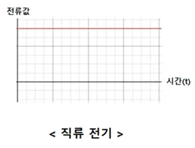

# 250408 산업용 전기 전자 이론

## 전기 전자 이론

### 전기의 종류

- 산업에서 사용하는 전기의 종류는 크게 **교류**와 **직류**로 구분할 수 있다.

- 대부분 DC 전기를 사용한다. (핸드폰 충전기, 어댑터 등…)

### 직류(DC) 전기

(+)극과 (-)극이 존재

- 3.3V
    
    미니센서, 아두이노, 라즈베리파이, PC의 작은 부품
    
- 5V
    
    미니센서, 아두이노, 라즈베리파이, PC의 작은 부품
    
    USB-A, 데이터 통신, 휴대폰 충전기 등
    
- 12V
    
    컴퓨터의 그래픽카드, ODD 장치 등
    
- 24V
    
    *산업에서 가장 많이 쓰이는 전압*
    
    LED, 센서, 모터 등
    
- 48V
    
    자동차, 로봇 모터 , 지쿠터 등
    

### 교류(AC) 전기

- 위상이 계속해서 변화
- R, S, T 또는 A, B, C
- 선과 선 사이의 위상차이가 계속해서 발생 → 전압의 차이가 발생
- 모터를 구동할 때 많이 사용

→ 단상 3선식은 요즘 많이 쓰이지 않는다.

### 교류(AC) 단상 3선식

- 메인 분전반으로부터 N(중성선)과 R상, S상이 들어올 경우 N상과 나머지 한상이 결합되어 220V를 제공한다.

- 한 라인에 걸쳐서 많은 기기가 연결되면 부하가 심해지므로 이를 분배하기 위해서 사용

### 교류(AC) 3상 3선식

- 3상 3선식의 경우(Δ)  상전압과 선간전압이 일치
- 3상 4선식의 경우 상전압과 선간전압이 일치하지 않는다.
    
    → 우리나라 전기는 다 이런 식
    

### 저항의 종류

- 전기를 인가하였을 때, 무언가 동작이 일어나는 부품 및 전기의 흐름이 원활하지 않은 부품
    - 램프, 모터, 히터, 센서…
- 스위치가 저항이 아닌 이유
    - 전기적으로 동작하지 않고, 사람의 손으로 직접 동작

### PNP & NPN 입력

- DC 전기에서 사용되는 출력신호 및 입력신호에 대한 극에 따른 분류 방법
- 내 기기가 PNP 기기면 (+) 신호가 나가는구나
- 내 기기가 NPN 기기면 (-) 신호가 나가는구나
- 산업용 현장 가면 노이즈에 강한 NPN 기기를 많이 쓴다.

## 입출력 스위치 및 센서

### 스위치

- 전류의 흐름을 물리적으로 차단, 전환, 허용하는 장치
- 스위치 접점 : 스위치에서 사용하는 A접점과 B접점

## PH-Lab

