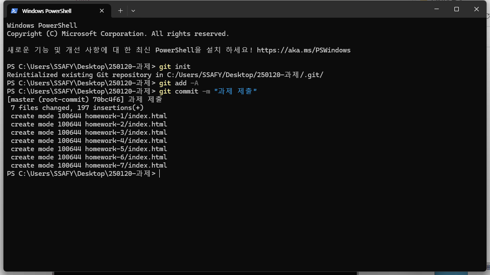

# 250120

## 관습적인 파일 네이밍

---

### html

- index.html
- board.html → 보통 게시판 페이지 만들때

### js (JavaScript)

- app.js, main.js - 가장 최상위 js 파일
- board.js - 게시판에 해당하는 js 파일

### css

- style.css, styles.css - 루트 css
- board.css - 게시판에 해당하는 css

## 단축키 / Web 기초 : HTML / CSS

---

태그는 열었으면 닫아줘야 된다.

- alt + shift + f
- 들여쓰기로 어디가 자식인지 구분 → 파이썬처럼 에러가 나지는 않지만
- ul>li*3
- a = anchor
- 한국어로 요소, 속성이라고 외우는 것은 사실 아무 의미가 없다.
- 디버거가 빨간줄로 출력해주는 것이 더 중요하기 때문이다.
- property
- attribute
- ex) Cannot read property of undefined를 봤을 때 아! 적어도 html은 아니네 하고 딱 오는 것.

### property

- JavaScript : 객체에서 키와 밸류의 묶음
- CSS : 선택자를 스타일링하는 문법. 마찬가지로, 키밸류 묶음

### attribute

- HTML : 태그의 속성

### element

- HTML : 태그의 다른 명칭
- JavaScript : 배열의 요소

### p와 div

- 글자를 넣을 땐 div 는 권장되지 않음.
- div는 어떠한 영역을 잡을 때 쓰는 것.

### span과 div

- 한 줄 전체를 차지할 땐 div
- 쓰인 영역만 차지할 땐 span
- 공통점 : 둘 다 만능태그

### ul li

- 원칙 : 반복적인건 전부 ul li로 써야한다.
- 실무에서는 “검색엔진최적화(SEO)” 라는 것을 함.
- 진짜 안좋은 습관 → 모든 것을 div로 처리함.

### wrapper와 container

- 자식이 하나면 wrapper라고 부르고
- 자식이 여러 개면 container로 네이밍하는 것이 정

### 단축키

- ctrl + d
- .parent1>div*2
- ctrl + alt + 방향키 = 다중 커서

## SSAFY를 하면서 안좋은 습관

---

- 아무 생각 없이 클론코딩

## 오후 라이브

---

- 프론트는 언어 3개가 혼용되어 쓰이는 곳이다.
1. HTML = 내용
2. CSS = 디자인
3. Java Script = 로직

```html
<!DOCTYPE html>
<html lang="en">
  <head>
    <meta charset="UTF-8" />
    <meta name="viewport" content="width=device-width, initial-scale=1.0" />
    <style>
      /* 우리 수업 때 사용할 방법 */
      /* 엘리먼트 element == tag 선택자 */
      p {
        /* property */
        color: pink;
      }
      /* id selector = 고유 식별자 */
      #number2 {
        border: 1px solid black;
      }
      /* kebab-case로 네이밍을 하는게 원칙 _말고 -로 이어주기 */
      #user-name {
        color: blue;
      }
      /* camelCase */
      #userName {
        color: red;
      }
      /* 클래스는 서로 다른 것을 그룹핑할 때 쓴다. */
      .etc {
        color: red;
      }
      /*  전체 폰트 통일할 때 */
      * {
        color: orange;
      }
    </style>
    <!-- <link rel="stylesheet" href="./style.css"> -->
    <title>Document</title>
  </head>
  <body>
    <!-- inline 적용 -->
    <p style="color: red">css 인라인 적용</p>
    <p>스타일 태그</p>
    <p>link 태그를 활용한 파일 분리</p>
    <p>1번</p>
    <p id="number2">2번</p>
    <p id="user-name">아이디</p>
    <p id="userName">아이디</p>
    <div class="etc">클래스</div>
    <p class="etc">클래스</p>
  </body>
</html>

```

```html
<!DOCTYPE html>
<html lang="en">
  <head>
    <meta charset="UTF-8" />
    <meta name="viewport" content="width=device-width, initial-scale=1.0" />
    <style>
      /* 여러개 클래스를 동시 지정하고 싶을 땐 묶어서 관리 */
      .p1,
      .p2 {
        color: blue;
      }
      .my-color{
        color: red;
      }
      .my-size{
        font-size: 2rem;
      }
    </style>
    <title>Document</title>
  </head>
  <body>
    <div class="p1">hi</div>
    <div class="p2">안녕</div>
    <!-- 여러개의 클래스를 적용할 때 한칸 띄우고 콤마찍지 말고 적는다 -->
    <p class="my-color my-size">안녕</p>
  </body>
</html>

```

### 픽셀과 rem의 차이

- 픽셀은 하드웨어적으로 고정, 특히 글자에서 안좋음.
- 웹 개발자는 모바일 태블릿 모니터를 고려해야함.
- 픽셀이 다 달라서 상대적인 크기가 중요 → 반응형 웹
- px은 반응형에선 피해야 하는 단위 : 특히 글자에

### rem

- 루트 폰트 기준 상대적 크기

```html
<!DOCTYPE html>
<html lang="en">
  <head>
    <meta charset="UTF-8" />
    <meta name="viewport" content="width=device-width, initial-scale=1.0" />
    <style>
      .my-word {
        font-size: 3rem;
        /* font-weight: bolder; */
        font-weight: 900;
        color: rgb(17, 102, 102);
        /* Hex Code */
        color: #F4D671;
        text-align: center;
        text-align: justify;
      }
      .box{
        border-bottom: 10px solid black;
        border-radius: 10px;
        height: 300px;
        width: 300px;
      }
      .custom-btn{
        width:100px;
        height: 30px;
        border: 1px solid black;
        border-radius: 10px;
      }
    </style>
    <title>Document</title>
  </head>
  <body>
    <p class="my-word">글자</p>
    <div class="box">

    </div>
    <div class="custom-btn">버튼 제작중</div>
  </body>
</html>

```

## 오후 강의

---

```html
<!DOCTYPE html>
<html lang="en">
  <head>
    <meta charset="UTF-8" />
    <meta name="viewport" content="width=device-width, initial-scale=1.0" />
    <style>
      .box {
        border: 1px solid black;
        height: 50%;
        width: 50%;
      }
      .box1 {
      }
      .box2 {
        background-color: pink;
        /* 패딩은 마진과 달리 크기를 바꿈 (안쪽 영역을 확장) */
        padding-top: 50px;
      }
    </style>
    <title>Document</title>
  </head>
  <body>
    <div class="box box1">box1</div>
    <div class="box box2">box2</div>
    <div class="box"></div>
  </body>
</html>

```

```html
<!DOCTYPE html>
<html lang="en">
  <head>
    <meta charset="UTF-8" />
    <meta name="viewport" content="width=device-width, initial-scale=1.0" />
    <style>
      .box-wrapper {
        width: 640px;
        height: 480px;
        border: 10px solid red;
      }
      .box {
        border: 1px solid black;
        height: 97vh;
        width: 99vw;
      }
    </style>
    <title>Document</title>
  </head>
  <body>
    <div class="box"></div>
  </body>
</html>

```

```html
<!DOCTYPE html>
<html lang="en">
  <head>
    <meta charset="UTF-8" />
    <meta name="viewport" content="width=device-width, initial-scale=1.0" />
    <style>
      .box {
        border: 1px solid black;
        height: 360px;
        width: 360px;
        background-color: aquamarine;
      }
      .box:hover {
        background-color: brown;
        cursor: pointer;
      }
      ul {
        padding: 0;
      }
      li {
        list-style: none;
      }
      a {
        text-decoration: none;
        color: black;
      }
      button {
        border: none;
        background-color: white;
        padding: 0;
        border: 1px solid black;
      }
    </style>
    <title>Document</title>
  </head>
  <body>
    <div class="box"></div>
    <ul>
      <li>짜장면</li>
      <li>짬뽕</li>
      <li>탕수육</li>
    </ul>
    <a href="#">네이버로 가자!</a>
    <button>버튼</button>
  </body>
</html>

```

## git 관련 등록

---

자리 바꿀 때마다 등록! 필쑤!!

1. 자격 증명 관리자 → Windows 자격 증명
2. 터미널로 들어가기
3. [git config --global [user.name](http://user.name/) "dan360"] 입력.
4. [git config —global [user.email](http://user.email) ”dan360@naver.com”] 입력.
5. 터미널 꺼버리기



내 토큰 : fxcwoXySzGF_tBd75xnu

1. 내 주소 복사 

`https://lab.ssafy.com/s13/c03/01-web-day1/1310969.git`


1. git 파일 remote 시키기


1. 창이 뜨면 이메일/토큰 입력해서 로그인

## git 잘못 올렸을 때 수정

---


## 보충

---

- tailwind 왜 쓸까?
- 어떤 스타일을 적용하고 싶을 때, 클래스를 그냥 넣으면 된다.
- 스타일시트 따로 안들고 다녀도 된다.
- 단점
- 테일윈드 없으면 못살아 ㅠㅠㅠ
- CSS 못쓴다…. →디펜던시
- 가독성에 취약

## boj 알고리즘

---

- dfs 2606 바이러스
- 15996 팩토리얼 나누기