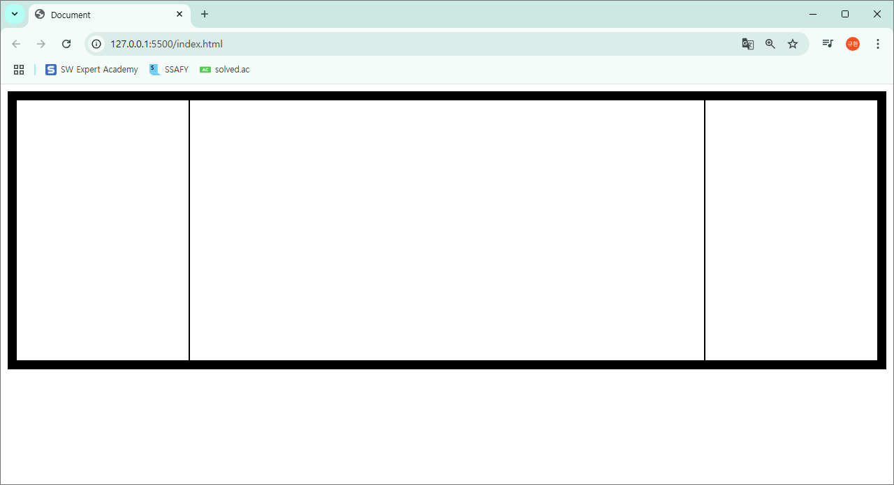

# 250121

# 모닝 라이브 강의

---

## Display 속성

---

- block, inline 등 태그에 따라 다름
- 각 태그에 등록된 display 속성은 flex, none 제외하고 변경하지 않는 것이 원칙

### Display: block 이면 화면의 한 줄을 차지한다?

→ No : 부모의 한 줄을 차지한다.

```html
<!DOCTYPE html>
<html lang="en">
  <head>
    <meta charset="UTF-8" />
    <meta name="viewport" content="width=device-width, initial-scale=1.0" />
    <style>
      .parent{
          border: 5px solid red;
          width: 100px;
      }
      .parent > p{
        border: 1px solid black;
      }
    </style>
    <title>Document</title>
  </head>
  <body>
    <div class="parent">
      <p>안녕</p>
    </div>
  </body>
</html>

```

### Inline 속성

- 크기 조절 안됨
- 마진 패딩 조절 어려움
- 정해진 영역 한 줄이 아님
- 쓰인 만큼만 차지한다.
- 대표적인 인라인 태그 : <a> <span>  <input> <select>

### 만능태그 : div와 span

- 만능태그인데 어떤 영역을 쳐야할 때 span을 써야할지 div를 써야할지 구분해서 써야한다.

### Inline-block

- 대표적인 속성 : <button>
- button의 영역은 대체 어떻게 구성되는가?
- 한 줄 전체를 차지 하지 않음, 누가 봐도 inline
- 근데 왜 Inline block?
- 마치 블록처럼 크기조절 가능하고, margin padding 조절 가능
- 블록과 인라인의 장점을 다 가짐

### button을 한 줄 전체가 차지할 수 있게 하려면?

- width : 100%

### display: none;

- 어따씀?
- java script 사용하면 특정 조건 만족했을 때 보이도록 할 수 있음
- 로그인한 유저라면, 로그인 버튼이 안 보이도록

### 주인공 : flex

- 가장 어렵지만, 가장 활용도 높다.
- 활용법 1. 정렬
- 활용법 2. 한 가운데!
- 활용법 3. 레이아웃
- 메인 축을 기반으로 정렬 진행
- 부모와 자식 간의 관계가 매우 중요
- 부모 : container
- 자식 : item
- 축을 바꿀 때에는 flex-direction
- 축 자체를 움직이고 싶을 때에는 align-items 대부분의 경우 center만 쓴다.

```html
<!DOCTYPE html>
<html lang="en">
  <head>
    <meta charset="UTF-8" />
    <meta name="viewport" content="width=device-width, initial-scale=1.0" />
    <style>
      .container {
        display: flex;
        /* flex-direction: column; */
        align-items: center;
        height: 100vh;
      }
      .box {
        border: 1px solid black;
        height: 100px;
        width: 100px;
      }
    </style>
    <title>Document</title>
  </head>
  <body>
    <div class="container">
      <div class="box"></div>
      <div class="box"></div>
      <div class="box"></div>
    </div>
  </body>
</html>

```

### 축 안에서 어떻게 동작할 것인가

- space-around, space-between, space-center 3가지

### flex를 이용한 기법

- flex-wrap : 밑으로 자연스럽게 떨어지게 만들고 싶을 때
- center-center 기법 : box를 정중앙으로 보내고 싶을 때

```html
align-items: center;
justify-content: center;
```

### 커스텀 버튼 만들기

```html
<!DOCTYPE html>
<html lang="en">
  <head>
    <meta charset="UTF-8" />
    <meta name="viewport" content="width=device-width, initial-scale=1.0" />
    <style>
      .btn {
        border: 1px solid black;
        border-radius: 10px;
        width: 80px;
        height: 40px;
        display: flex;
        align-items: center;
        justify-content: center;
      }
    </style>
    <title>Document</title>
  </head>
  <body>
    <div class="btn">
      <span>버튼</span>
    </div>
  </body>
</html>

```

### flex 왜 쓰는가

1. 정렬
2. 한 가운데
3. 레이아웃

### Holy Grail Layout

- 성배처럼, 보물같은, 굉장히 귀한
- 구현하기 어려운 레이아웃

### Semantic Elements

- div랑 똑같지만 div 대신 쓰라고 나온 태그
- div 보다 보기 편하고 확실히 와닿는다.
- 가독성
- SEO 검색엔진최적화

```html
<!DOCTYPE html>
<html lang="en">
  <head>
    <meta charset="UTF-8" />
    <meta name="viewport" content="width=device-width, initial-scale=1.0" />
    <style>
      main {
        border: 10px solid black;
        height: 300px;
        display: flex;
      }
      section,
      article,
      aside {
        border: 1px solid black;
      }
      section {
        flex: 1;
      }
      article {
        flex: 3;
      }
      aside {
        flex: 1;
      }
    </style>
    <title>Document</title>
  </head>
  <body>
    <main>
      <section></section>
      <article></article>
      <aside></aside>
    </main>
  </body>
</html>

```



## position 속성

---

### 언제 쓰는가?

- 위치 배정
- 모든 태그는 ‘position: static’ → 가장 기본
- 위치를 지정하고자 하는 방식에 따라 세 가지를 지정할 수 있다.
- → relative
- → absolute
- → fixed
- 위치 지정할 때 : top, bottom, left, right
- fixed 빼고는 웬만하면 쓰지 마십시오.
- → 챗봇 같은거 만들 때 위치 고정 용도
- position은 쓰지 말고, flex를 쓴다던지 margin, padding 등으로 대체해서 레이아웃이 무너지지 않게

### relative

- 부모를 기준으로 옮기는 것

### absolute

- static이 아닌 부모가 기준이다.
- 그러면 static인 부모? ⇒ 원래 모든 태그는 static
- ⇒ position을 relative나 absolute로 설정하지 않은 부모(조상)

### fixed

- 챗봇 같은거 위치 고정
- 화면이 기준

# boj

---

- 10828 스택
- 10848 큐
- 2437 저울