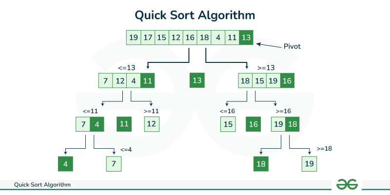

# 250204

# 알고리즘 Live 강의

---

## Sort 기본

---

### 정렬의 종류

- 비 효율적인 정렬
    
    선택
    
    삽입
    
    버블
    
    ⇒ 특정 상황에선 사용해도 무방함. (N이 그렇게 크지 않을 때)
    
- 좀 더 스마트한 정렬법 (시간복잡도 nlogn)
    
    퀵소트
    
    머지소트
    
    힙소트 (PQ)
    

### 오늘 할 것 : 퀵소트 (C++)

1. 오름차순
2. 내림차순
3. 구조체 커스텀 정렬

### sort를 위한 algorithm 헤더

- max, min, sort, abs 를 쓰기 위해 헤더를 가져온다.
- algorithm 헤더 없어도 사용 되던데요?
    
    → 아뇨 쓰세요. 컴파일러마다 참고하는 헤더의 목록이 달라서 그럴 수도 있는 것.
    

```cpp
// 실제로 sort 사용해보기 예제
#include <iostream>
#include <algorithm>	// max, min, sort, abs...

using namespace std;

int main()
{
	int arr[5] = { 4,2,5,3,1 };

	int n = sizeof(arr) / sizeof(arr[0]);

	sort(arr, arr + n);

	return 0;
}
```

### Vector를 정렬해보자

- vector는 sort시에 시작과 끝의 iterator를 받아야 한다.
    
    ex) `sort(v.begin(), v.end());` 
    
- 배열도 그렇고 벡터도 그렇고 정렬 시 실제로 원본 데이터가 변경된다는 것에 유념.

### 내림차순 정렬하기

- 세번째 파라미터를 사용해준다. `greater<int>()`
- 내림차순의 약어 : DESC
    
    → SQL에서도 많이 사용하니 알아둘 것.
    

```cpp
int main()
{
	int arr[5] = { 4,2,5,3,1 };
	int n = sizeof(arr) / sizeof(arr[0]);

	sort(arr, arr + n, greater<int>());

	return 0;
}
```

### 구조체는 어떻게 정렬할까

- 일단 Member 구조체를 만들어보자 `struct Member`
    
    → 참고) 보통 네이밍을 할 때, User는 쓰지 말 것. 배포를 하거나 할 때 오류가 날 가능성이 있다.
    
- compare 함수가 필요하다.

```cpp
// 이름별 오름차순을 하는 compare 함수 예제
bool compare(Member a, Member b)
{
	return a.name < b.name;
}
```

### Sort 함수 알고리즘



### compare 함수를 다음과 같이 쓰지 말자

```cpp
bool compare(Member a, Member b)
{
	if (a.age > b.age)
		return true;
	else
		return false;
}
```

- 실수할 가능성이 너무 높음.
- else 구문 빼먹을 시, void가 리턴.
- 시간적으로도 손해.

## Greedy 알고리즘

---

### 완전탐색(DFS/BFS) vs Greedy

1. 완전탐색 : 아… 이게 맞을까?
    
    저게 맞을까?
    
    저렇게 하는게 맞나?
    
    이게 맞나?
    
    이렇게 하면 위험할까?
    
    ⇒ 우유부단
    
    ⇒ 그래서, 우유부단을 줄이는 연습
    
    ⇒ 그 와중에도, 여기로 가면 쓸데 없다라는 일종의 확신이 있어야 함.
    
2. Greedy : 겁나게 빠름
    
    그 선택이 맞는지는 검증이 필요.
    
    확실한 선택에만 그리디를 쓸 수 있는 것.
    

### 다음에서 Level 3까지 가는데에 드는 최소한의 시간은?


- 완전탐색은 하나 하나 다 계산해본다.
- Greedy는 당장의 앞만 보고 판단 → 위 문제에서는 최적의 해를 구할 수 없음.
- 완탐이 적합.

### 하지만 다음 문제에서의 최적해는?


- 여기에서는 다른 end-point가 존재하지 않음.
- 당장 다음 Level로 가는 길로 최단 경로만 고르면 됨.
- 그리디가 적합.

### Greedy 알고리즘 3가지 원칙

- 편의점에서 알바 중…
    
    손님이 현금을 들고와서 거스름돈을 줘야 함.
    
    품목: 3만4천7백원
    
    손님이 오만원을 주었다!
    
    이 경우,
    
    50000
    
    10000
    
    5000
    
    1000
    
    500
    
    100
    
    50
    
    10
    
    → 만원 1장 오천원 1장 백원 3개
    
1. Greedy Choice Property (탐욕적 선택 속성)
    
    매 순간 가장 큰 금액의 동전을 선택한다.
    
2. Optimal Substructure (최적 부분 구조)
    
    단계별로 나눌 수 있어야 한다.
    
    각 단계의 기준은 동일해야 한다.
    
3. No Afteraffect (선택의 독립성)
    
    한번 선택하면 바꾸지 말아야 한다.
    

# 풀다 만거

---

```cpp
#define _CRT_SECURE_NO_WARNINGS
#include <iostream>
#include <algorithm>
#include <cstring>

using namespace std;

int N, X;
int ground[20][20];
int slope[20][20];

bool x_checkSlope(int y, int x, bool asc)
{
	if (y == 0 && x == 5)
	{
		
	}
	if (asc)
	{
		int flat = ground[y][x - 1];
		for (int i = 2; i <= X; i++)
		{
			if (ground[y][x - i] == flat && x - i >= 0 && slope[y][x - i] == 0)
			{
				slope[y][x - i] = 1;
				continue;
			}
			else
			{
				return false;
			}
		}
		return true;
	}
	else
	{
		int flat = ground[y][x];
		for (int i = 1; i < X; i++)
		{
			if (ground[y][x + i] == flat && x + i < N && slope[y][x + i] == 0)
			{
				slope[y][x + i] = 1;
				continue;
			}
			else
			{
				return false;
			}
		}
		return true;
	}
}

bool y_checkSlope(int y, int x, bool asc)
{
	if (asc)
	{
		int flat = ground[y - 1][x];
		for (int i = 2; i <= X; i++)
		{
			if (ground[y - i][x] == flat && y - i >= 0 && slope[y - i][x] == 0)
			{
				slope[y - i][x] = 1;
				continue;
			}
			else
			{
				return false;
			}
		}
		return true;
	}
	else
	{
		if (abs(ground[y + 1][x] - ground[y][x]) > 1)
		{
			return false;
		}
		int flat = ground[y][x];
		for (int i = 1; i < X; i++)
		{
			if (ground[y + i][x] == flat && y + i < N && slope[y + i][x] == 0)
			{
				slope[y + i][x] = 1;
				continue;
			}
			else
			{
				return false;
			}
		}
		return true;
	}
}

int init()
{
	memset(slope, 0, sizeof(slope));

	return 0;
}

int input()
{
	cin >> N >> X;

	for (int i = 0; i < N; i++)
	{
		for (int j = 0; j < N; j++)
		{
			cin >> ground[i][j];
		}
	}

	return 0;
}

int x_simulate()
{
	int cnt_x = 0;
	for (int i = 0; i < N; i++)
	{
		bool canBuild = true;
		for (int j = 1; j < N; j++)
		{
			//memset(slope, 0, sizeof(slope));
			if (ground[i][j - 1] != ground[i][j])
			{
				if (x_checkSlope(i, j, ground[i][j - 1] < ground[i][j]))
				{
					continue;
				}
				else
				{
					canBuild = false;
					break;
				}
			}
		}
		memset(slope, 0, sizeof(slope));
		if (canBuild)
		{
			cnt_x++;
		}
		else
		{
			canBuild = true;
		}
	}

	return cnt_x;
}

int y_simulate()
{
	int cnt_y = 0;
	for (int i = 0; i < N; i++)
	{
		bool canBuild = true;
		for (int j = 1; j < N; j++)
		{
			//memset(slope, 0, sizeof(slope));
			if (abs(ground[j - 1][i] - ground[j][i]) > 1)
			{
				canBuild = false; //cout << i << endl;
				break;
			}
			if (ground[j - 1][i] != ground[j][i])
			{
				if (y_checkSlope(j, i, ground[j - 1][i] < ground[j][i]))
				{
					continue;
				}
				else
				{
					canBuild = false; //cout << i << endl;
					break;
				}
			}
		}
		memset(slope, 0, sizeof(slope));
		if (canBuild)
		{
			cnt_y++;
		}
		else
		{
			canBuild = true;
		}
	}

	return cnt_y;
}

int main()
{
	int T;
	int test_case;

	freopen("sample_input.txt", "r", stdin);

	cin >> T;

	for (test_case = 1; test_case <= T; test_case++)
	{
		int cnt_x, cnt_y;
		init();
		input();
		cnt_x = x_simulate();
		cnt_y = y_simulate();

		cout << "#" << test_case << " " << cnt_x + cnt_y << "\n";
	}

	return 0;
}
```

