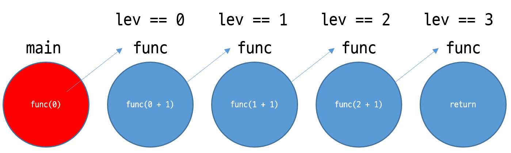

# 250205

# 알고리즘 Live 강의

---

## 재귀

---

### 재귀의 기본적인 형태

```cpp
//재귀의 기본적인 형태
void func()
{
	func();
}
```

- 어떻게 정의가 끝나지도 않았는데 함수를 사용을 할 수 있었나? 참 이상한 녀석이다.
- 재귀는 무한루프를 전제로 한다. 재귀라는 것은 위험한 녀석.
- 실무에서 재귀를 쓴다? 재귀를 쓰는 것은 다른 팀원한테 무례한 녀석.
- 고럼 왜 배우죠? 우리 시험쳐야 한다.
    
    → A형 → 완전탐색 → DFS/Backtracking 에서 사용.
    
    출제 비율 : 시뮬 40%, DFS 30에서 20% 완전 높음.
    

### 재귀는 언제 쓰는가?

- 언제 끝날지 모를 때.
- 재귀는 1중 2중 3중….8중…이 될 수도 있다.

### 종료조건 (기저조건)

```cpp
void func(int lev)
{
	// 종료조건
	if (lev == 3)
		return;

	func(lev + 1);
}

int main()
{
	func(0);

	return 0;
}
```

### 도식화



### 용어 정리

lev : 얼마나 깊은지 여부

brench : 몇 개로 갈리는지 여부 (가지)

SSAFY8112

# 풀다 만거

---

```cpp
#define _CRT_SECURE_NO_WARNINGS
#include <iostream>

using namespace std;

struct Atom
{
	bool survive;
	int y, x;
	int dir;
	int energy;
}atoms[1000];

int space[2001][2001];
int dy[] = { 1, -1, 0, 0 };
int dx[] = { 0, 0, -1, 1 };
int N;
int sum = 0;

int init()
{
	for (int i = 0; i < 1000; i++)
	{
		atoms[i].energy = 0;
		atoms[i].y = 0;
		atoms[i].x = 0;
		atoms[i].dir = 0;
		atoms[i].survive = true;
	}

	for (int i = 0; i < 2001; i++)
	{
		for (int j = 0; j < 2001; j++)
		{
			space[i][j] = -1;
		}
	}

	N = 0;
	sum = 0;

	return 0;
}

int input()
{
	cin >> N;

	for (int i = 0; i < N; i++)
	{
		cin >> atoms[i].x >> atoms[i].y;
		cin >> atoms[i].dir >> atoms[i].energy;
		
		atoms[i].x += 1000;
		atoms[i].y += 1000;
	}

	return 0;
}

int simulate()
{
	for (int i = 0; i < N; i++)
	{
		space[atoms[i].y][atoms[i].x] = i;
	}

	for (int t = 0; t < 2000; t++)
	{
		for (int i = 0; i < N; i++)
		{
			if (!atoms[i].survive)
			{
				continue;
			}

			space[atoms[i].y][atoms[i].x] = -1;

			atoms[i].y += dy[atoms[i].dir];
			atoms[i].x += dx[atoms[i].dir];
			if (atoms[i].y < 0 || atoms[i].y > 2001 || atoms[i].x < 0 || atoms[i].x > 2001)
			{
				atoms[i].survive = false;
				continue;
			}
			if (space[atoms[i].y][atoms[i].x] != -1)
			{
				int target = space[atoms[i].y][atoms[i].x];
				if (target < i)
				{
					atoms[i].survive = false;
					atoms[target].survive = false;
					space[atoms[i].y][atoms[i].x] = i;
					sum += atoms[i].energy + atoms[target].energy;
					atoms[i].energy = 0;
					atoms[i].dir = 5;
					atoms[target].dir = 5;
				}
				else if (target > i)
				{
					if (atoms[i].dir == 0 && atoms[target].dir == 1)
					{
						atoms[i].survive = false;
						atoms[target].survive = false;
						space[atoms[i].y][atoms[i].x] = -1;
						sum += atoms[i].energy + atoms[target].energy;
					}
					else if (atoms[i].dir == 1 && atoms[target].dir == 0)
					{
						atoms[i].survive = false;
						atoms[target].survive = false;
						space[atoms[i].y][atoms[i].x] = -1;
						sum += atoms[i].energy + atoms[target].energy;
					}
					else if (atoms[i].dir == 2 && atoms[target].dir == 3)
					{
						atoms[i].survive = false;
						atoms[target].survive = false;
						space[atoms[i].y][atoms[i].x] = -1;
						sum += atoms[i].energy + atoms[target].energy;
					}
					else if (atoms[i].dir == 3 && atoms[target].dir == 2)
					{
						atoms[i].survive = false;
						atoms[target].survive = false;
						space[atoms[i].y][atoms[i].x] = -1;
						sum += atoms[i].energy + atoms[target].energy;
					}
				}
			}
			else
			{
				space[atoms[i].y][atoms[i].x] = i;
			}
		}
	}

	return 0;
}

int main()
{
	int T;
	int test_case;

	freopen("sample_input.txt", "r", stdin);

	cin >> T;

	for (test_case = 1; test_case <= T; test_case++)
	{
		init();
		input();
		simulate();

		cout << "#" << test_case << " " << sum << "\n";
	}

	return 0;
}
```