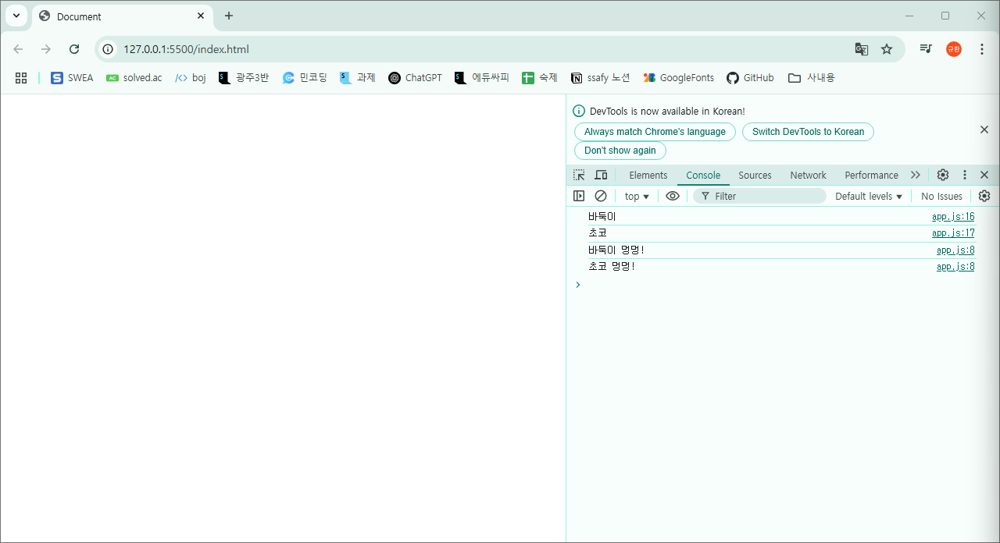

# 250211 Live 자바스크립트 클래스

# Live 강의 JS Class / Promise

## Class

### class란?

- 정확한 설명은 아니지만 c++의 구조체를 생각

```cpp
Member
{
	int id;
	char name[10];
	int age;
};

Member members[10] = {
	{1, "jony", 20},
	{2, "sylbie", 20},
	{3, "nana", 4},
};
```

- 구조체의 타입은 string이나 char, double과 같은 타입으로는 원하는 정보를 표현하기 불편했을 때 사용했음.
- class 역시 커스텀 타입
- 구조체와의 근본적인 차이점 : 함수를 쓸 수 있다!

```cpp
Member
{
	int id;
	char name[10];
	int age;
	
	// 함수를 넣는다? -> 함수를 넣으려면 void pointer를 callback으로
										// 한다던지 하는 특별한 방법이 아니면 쉽지 않다.
										// 일단 넣는다고 가정
	introduce();
	setName(newName);
};

// 제 이름은 누구누구이고, 나이는 몇살입니다!
member1.introduce();

member1.setName("david");
```

- class는 커스텀 타입인데, 구조체와는 다르게 메서드(커스텀 함수)라는 것을 쓸 수 있다.

```jsx
class Dog {
  constructor(name, age) {
    this.name = name;
    this.age = age;
  }

  bark() {
    console.log(`${this.name} 멍멍!`);
  }
}

// 객체 (object)
const dog1 = new Dog("바둑이", 3);
const dog2 = new Dog("초코", 2);

console.log(dog1.name);
console.log(dog2.name);

dog1.bark();
dog2.bark();
```



```cpp
Point
{
	int y;
	int x;
}

Point p1 = {1, 2};

// 말도 안되는 것이고
// 컴파일 에러를 일으킨다.
p1.z = 3;
```

- 위는 구조체의 경우.
- 타입은 강제하는 것. 위는 말도 안됨.

```jsx
class Point {
	int y;
	int x;
}

Point p1 = {1, 2};

p1.z = 3;
```

- **이미 만들어지고 나서 원하는 것을 추가하는 것은 말도 안된다.**
- 언어 상식적으로,
- 타입으로 정해놨으면 타입 안에서만 놀아야 하고,
- 그 이후에 다른 변수나 메서드를 추가하면
- 당연히 컴파일 에러가 나야 하는데…
- 근데 왜 되지????

```jsx
class Dog {
  constructor(name, age) {
    this.name = name;
    this.age = age;
  }

  bark() {
    console.log(`${this.name} 멍멍!`);
  }
}

// 객체 (object)
const dog1 = new Dog("바둑이", 3);
const dog2 = new Dog("초코", 2);

console.log(dog1.name);
console.log(dog2.name);

dog1.bark();
dog2.bark();

dog1.ownerPhoneNumber = "010-6666-7777";
dog2.eat = function(){
    console.log("잘 먹겠습니다 주인님.");
}

console.log(dog1);
dog2.eat();
```

- 아! JavaScript 개발자는 근본을 모르는 사람이라서 아주 큰 실수를 했구나!
    
    ⇒ 그냥 의도하고 그렇게 만든 것이다.
    
- 다른 언어들과는 다르게 JavaScript 혼자서 클래스는 타입이 아니라고 깡그리 무시 중.

### JavaScript의 객체

1. 클래스가 없는데 왜 객체가 만들어 질 수 있지?
    
    클래스를 만들지도 않고 객체를 선언하는 것이 일반적인 JavaScript의 방법.
    
2. 객체는 내가 이제까지 배웠던 객체 지향에서 배웠던 그 객체가 아닌 것일까?
    
    다른 객체지향 언어의 객체는 Object : 클래스의 인스턴스
    
    하지만 JavaScript에서의 객체는 : 키와 밸류로 이루어진 Property의 모음
    
3. JavaScript에서 class 라는 개념이 없을까?
    
    문법적으로는 제공하는데, 엄밀히 말하면 없다.
    
    “Prototype” 기반임.
    
    프라이빗, 퍼블릭 개념이 없어서 캡슐화도 안되고…
    
4. JavaScript 개발자 (React 개발자)는 객체지향을 안하는가
    
    ㅇㅇ
    

오늘은 이런 상황에서도, JavaScript에서 객체지향을 “굳이” 하려면 뭘 알아야 하는가를 정리

### 프로토타입

```jsx
const dog1 = {
  name: "바둑이",
  age: 3,

  bark: function () {
    console.log(`${this.name} 멍멍!`);
  },
};

const dog2 = {
  name: "몽실이",
  age: 4,
  bark: function () {
    console.log(`${this.name} 멍멍!`);
  },
};
```

- 위와 같은 것이 수십개가 넘어간다면?
    
    아주 귀찮을 것.
    
    다른 언어의 클래스와 같은 것들이 있다면 좋을텐데….
    
- 다른 객체지향 언어처럼 클래스를 도입하면,
    
    JavaScript 의 자유도는 떨어진다…
    
    Java 는 엄격함 그 자체
    
- JavaScript는 클래스가 없으니 프로토타입이란 것을 사용

### 프로토타입의 생성자 정의

```jsx
// Prototype 생성자 (constructor) 정의 구문
// 일반 함수와 똑같이 생겼는데, this에 접근한다는 점이 다르다.
// 대문자로 시작함
function Dog(name, age) {
  this.name = name;
  this.age = age;
}

// 함수를 안쪽으로 집어넣을 수 없으니까,
// 밖에 따로 정의해서 사용.
// 들어갈 때 prototype을 사용.
Dog.prototype.bark = function () {
  console.log(`${this.name} 멍멍!`);
};

const dog1 = new Dog("바둑이", 3);
dog1.bark();

dog1.ownerPhoneNumber = "010-6666-7777";

// console.log(dog1);
```

- 프로토타입이란 무엇인가?
    
    ⇒ “덜 만들어진” 타입
    
- 클래스 기반 언어들과 무엇이 다른가?
    
    ⇒ “객체 생성 후에” 맘대로 변수나 메서드를 추가할 수 있다.
    

### 프로토타입이 클래스 기반 객체지향보다 좋은 점

- 타입의 강제성이 없기에, 구현 자유도가 높아진다.

but, 단점

- 타입의 강제성이 없기에, 디버깅 난이도가 올라감.
    
    일부 개발자 특: class를 제발 주세요!!
    
    마 침 내
    
    2015년 ES6
    
    클래스 문법이 도입.
    

## JavaScript 클래스의 등장

### 아직 아무리 봐도 prototype일 뿐인데?

- 맞음.

### 객체지향의 4대 요소를 쓰시오

1. 상속
2. 캡슐화
3. 다형성
4. 추상화

→ 적용하지 않고 객체지향으로 개발한다고 말도 꺼내지 말라.

- JavaScript에선, 위 네가지가 구현되어 있을까?
    1. 상속 : O
    2. 캡슐화 : X (private / public)
    3. 다형성 : O (overloading / overriding)
    4. 추상화 : X (abstract / interface)
    
    더 화나는건, 클래스로 뭔가를 만들어놨는데
    
    객체 생성 후, 변수나 메서드를 만대로 추가할 수 있다.
    
    원래 타입 강제하려고 클래스를 쓰는건데….
    

### JavaScript에서 클래스라는건…

문법 설탕일 뿐이다. (syntactic sugar)

여러분들이 진짜 JavaScript 에서 객체지향을 하고 싶다면 : TypeScript

### 결론

JavaScript 에서 OOP 하려면 이단아의 길을 걸어야 하기 때문에

굳이 하겠다면  TypeScript를 하길 바랍니다.