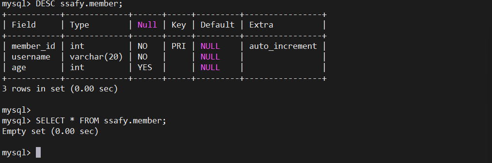

# 250213

# 코딩 Live 강의 DB : SQL 문법

## Database 개요

### DB는 왜 쓰는 것일까?

- 데이터를 저장할 수 있는 방법은?
    - 파일 입출력
    - 엑셀 형식으로 저장
- 여기서 생기는 3가지의 문제점
    1. 보안
        1. 패스워드를 설정해서 최대한 안전하게 관리한다고 해도 한계가 있다.
        2. 대리나 부장과 같이 직급 등에 따른 권한을 다르게 부여하고 싶은데,
            
            이를 디테일하게 설정해주기 힘듬.
            
    2. 프로그래밍
        1. 메모장이나 엑셀은 프로그래밍 언어가 아님.
        2. Javascript나 Python 등 언어마다 제공하는 라이브러리가 제각각이다.
        3. CRUD
            
            > IT의 본질.
            > 
            > 
            > Create : 생성
            > 
            > Read : 읽기
            > 
            > Update : 수정
            > 
            > Delete : 삭제
            > 
        4. Todo List 라는 것이 CRUD가 다 들어가 있어서 언어 배우는 데에 적합한 실습.
    3. 속도
        1. 파일 입출력에 있어서 코드가 제일 빠름.
        2. 웹 서비스에선 데이터를 저장할 때, DBMS (DataBase Management System)을 사용.

### 데이터베이스의 2가지 분류

1. SQL 기반 관계형 데이터베이스
    - Oracle : 유료 1위 (업계 1위)
    - MySQL : 무료 1위
    - PostgreSQL : 북미 1위, 오픈소스 친화적(next js - react)
    - SQLite : 가벼움이 강점, 결과물이 파일 한 개
2. NoSQL 기반 비관계형 데이터베이스
    - MongoDB : Type을 따로 정해두지 않는 것이 최대 장점
        - MongoDB는 json 형식이기 때문에 자유로움
        - 각각 배열의 Type이 일정하지 않아서 원치 않는 결과를 불러올 가능성
    - Firebase의 Firestore

### 대체 SQL이 뭐냐?

- SQL 기반 관계형 데이터베이스 : 여러 개의 표로 이루어진 DB
- 필드와 ROW
- Database 안에는 여러 개의 DB가 있고
    
    DB 안에는 여러 개의 테이블이 있고
    
    그 테이블 간 “관계”를 설정해서
    
    활용하는 DB 형태를 “관계형 데이터베이스”
    
- SQL의 가장 기본적인 문법 CRUD

## SQL 문법 연습

### 현업에서는 무엇을 제일 많이 쓸까?

- 터미널 vs GUI
    - 현업에서는 터미널을 더 많이 쓴다.
    - GUI는 버전이 바뀌면서 계속 UI가 바뀐다는 단점이 존재.

### DB 만들기

```sql
CREATE TABLE `ssafy`.`member` (
    `member_id` INT NOT NULL AUTO_INCREMENT,
)
```

- ssafy 라는 DB 안에 member 라는 필드를 만들겠다.
    
    그 중에서 member_id는 자동으로 증가되는 수.
    
    mySQL은 백틱 ` 필수. (CREATE와 INSERT만)
    
- 이 때의 ID를 Primary Key (PK)
    
    : 전체 데이터에서 식별할 수 있는 기준이 되는 것.
    

```sql
CREATE TABLE `ssafy`.`member` (
    `member_id` INT NOT NULL AUTO_INCREMENT,
    `username` VARCHAR(20) NOT NULL,
    `age` INT NULL,
    PRIMARY KEY (`member_id`));

DESC ssafy.member;

SELECT * FROM ssafy.member;
```



fig1. 결과

- ID가 INT가 아닐 수도 있음.
    
    PK가 AUTO_INCREMENT가 아니어도 되고, VARCHAR일 수도 있음.
    
    중복일 경우 DB가 거부해버림.
    
- 그래도 보통은 PK와 ID를 따로 두는 것이 원칙. (속도의 문제)
- 대문자 소문자는 관습의 문제
    
    SQL 문법과 사용자가 정하는 값을 구분해주기 위해서 대소문자를 구별.
    

### DB 넣기

```sql
INSERT INTO `ssafy`.`member` 
(`username`, `age`)
VALUES('조니', 40);

INSERT INTO `ssafy`.`member` 
(`username`, `age`)
VALUES('실비', 20);

INSERT INTO `ssafy`.`member` 
(`username`)
VALUES('나나');
```


fig2. 결과

- TABLE 잘못 만들었다면, 날리는 법 `DROP TABLE ssafy.member;`
- 특이한 점 : INSERT 때, member_id를 넣어준 적이 없다.
    
    pk는 개발자가 건드리지 않는 것이 원칙.
    

### 조회 하기

- SQL은 다른 언어와 달리 조회가 제일 어려움.

```sql
-- 전체 조회
SELECT * FROM ssafy.member;
```

되게 위험한 명명.

농협은행 고객이 천만명이라고 가정해보자.

`SELECT * FROM ssafy.member;` 라고 친다면, 무슨 일이 일어날까...?

```sql
-- 전체 조회
SELECT * FROM ssafy.member LIMIT 1000;
```

### 삭제 하기

`DELETE` 와 `DROP` 

### 테이블명을 user로 짓는 것은 피해야 한다.

member로 대체.
