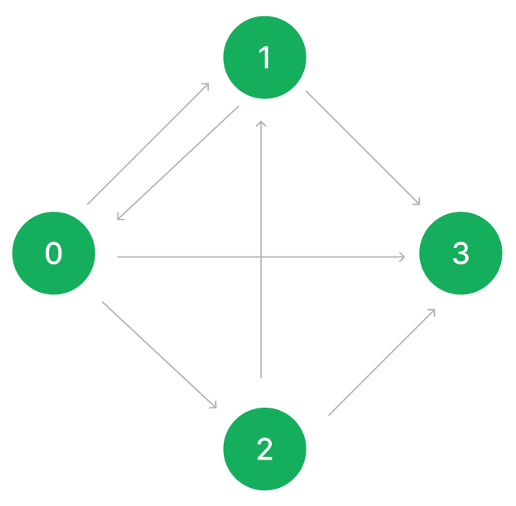

# 250217

# 알고리즘 Live 강의

## Tree, Graph

### 개요

- 싸이클이 존재하면  Graph
- 싸이클이 존재하지 않아야 Tree
- 지금까지 Graph를 다뤄본 적은 없음.

### Graph 이해하기



fig 1. 그래프 이미지

- 각각의 원을 노드, 선을 엣지라고 한다.
- fig 1. 이미지의 그래프는 노트가 4개, 엣지가 7개이다.
- 그래프를 다음과 같이 인접행렬의 형태로 변환이 가능하다.

```cpp
0 1 1 1
1 0 0 1
0 1 0 1
0 0 0 0
```

- 0은 사실 의미가 없는 정보, 그냥 간선 정보만 담으면 안될까?
- 인접리스트(벡터)

```cpp
v[0] : 1, 2, 3
v[1] : 0, 3
v[2] : 1, 3
```

- 행렬이 공간을 많이 차지하지만 속도는 훨씬 빠름.
- 입력에 따라 적합한 것을 선택해서 사용할 것.

### cost 그래프


fig 2. cost 그래프

- 경로에 cost가 나타나있다.
- cost는 거리가 될 수도, 연료가 될 수도 있고 다양한 값이 올 수 있다.
- 다음과 같이 변환이 가능하다.

```cpp
0 15 10 27
2 0 0 1
0 5 0 8
0 0 0 0
```

- 벡터로는 다음과 같이 표현이 가능

```cpp
v[0] : {1, 15}, {2, 10}, {3, 27}
v[1] : {0, 2}, {3, 1}
v[2] : {1, 5}, {3, 8}
```

```cpp
0 7 0 0 0
3 0 1 1 7
0 0 3 0 0
0 6 0 0 3
0 0 0 0 0

v[0] : {1, 7}
v[1] : {0, 3}, {2, 1}, {3, 1}, {4, 7}
v[2] : {2, 3}
v[3] : {1, 6}, {4, 3}
v[4] 
```

## DFS

### 개요

- Depth-First Search
- 깊게 갈 수 있는 데까지 간다.
- 모든 경우를 다 둘러봐야 할 때 사용함.
- 해결을 위해, 재귀 사용.
    - 얼마나 돌려야 할지 모름
    - 재귀는 조건에서 걸리면 실행 안하고 끝나버리는 특징

### 디저트카페 공략 계획

### 구성요소

1. N : 2차원 배열의 한 변의 길이 (4 ≤ N ≤ 20)
2. MAP[20][20] 으로 선언
3. 디저트 종류를 나타내는 수는 1 이상 100이하의 정수
    
    → 101칸짜리 visited 배열을 선언해서 먹었던 디저트를 또 먹지 않도록 하기
    
4. 갔던 경로는 또 가지 않아야 하므로 MAP과 동일한 크기의 2차원 배열을 선언

### 주의사항

1. 시계 방향 / 반시계 방향 어떤 식으로 돌던 상관 없이 먹는 디저트의 종류는 똑같다.
    
    즉, 같은 케이스를 탐색하지 않도록 설계한다.
    
2. 하나의 카페에서 디저트를 먹는 경우를 배제한다.
3. 왔던 길을 그대로 되돌아가서는 안된다.
4. 출발했던 지점을 그대로 되돌아와야 한다.
5. 문제의 규칙을 점검해볼 때, 어차피 꼭짓점에 위치한 디저트 카페는 방문할 수 없다.
    
    → 꼭짓점에 위치한 디저트 카페는 신경쓰지 않는다.
    

### 대강의 구조

1. 대각선으로만 이동하므로 대각선 방향의 방향 벡터를 제작
    
    ```cpp
    // 방향 : 우하, 좌하, 좌상, 우상
    int dy[] = { 1, 1, -1, -1 };
    int dx[] = { 1, -1, -1, 1 };
    ```
    
2. 출발 지점에 돌아오면 재귀를 종료
3. 재귀 함수의 인수를 깊이(레벨)와 x좌표, y좌표로 받는 것도 고려