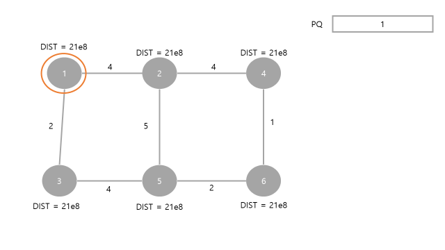

# 250226

# 다익스트라 알고리즘 소개

## 해야 될 이유

### 1. A형 단골

최근에 출제 비중이 50%로 늘어남.

### 2. 쓰이는 곳이 많음

실무적으로 쓴다. ⇒ 최단거리

ex) 네비게이션

## 다른 알고리즘과의 비교

1. PQ : 우선 순위 큐
2. BFS - 최단거리 구할 수 있는 조건
    
    ⇒ 코스트가 동일할 때
    
    다익스트라는 코스트가 다를 때 사용
    
    (이 다음부터는 A형 따는데 꼭 필요하지 않은 알고리즘 선)
    

---

1. 거리인데, 음수가 포함된다?
    
    ⇒ 벨먼-포드 알고리즘
    
2. 다대다 (모든 시작점에서, 모든 정점으로 가는 최소)
    
    ⇒ 플로이드-워셜
    

# 다익스트라 개념

## 다익스트라 원리 알아보기

### 그래프와 우선순위 큐의 초기 상태



### 다익스트라는 visited가 필요없다.

핵심은, 원래 있던 값보다 새로 들어갈 거리가 더 짧다.

ex) 어떤 특정 노드의 원래 “누적된 거리”가 4였다.

새로운 누적 거리가 3이다.

PQ에 담아? 안 담아? ⇒ 안 담아


### 다익스트라가 진행된 상태의 결과


### 결론적으로 다익스트라는 왜 쓰지?

cost가 각각 다른 그래프일 때, 하나의 시작점에서 모든 정점에 이르는 거리를 계산

## 다익스트라의 가지치기

### 가지치기가 필요한 경우


3이 먼저 PQ에서 나오고 갱신이 되지 않은 채로 종료.

그 다음으로 또 3 노드의 dist 값이 3이기 때문에 3이 또 나오게 됨.

굳이 따져볼 필요가 없는 경우가 된다.

# 다익스트라의 구현

### 코드 구현

```cpp
#define _CRT_SECURE_NO_WARNINGS
#include <iostream>
#include <vector>
#include <queue>

using namespace std;

// 현재 노드까지 갔던 정보
struct Edge
{
	// 현재 노드
	int num;

	// 노드까지 갔던 거리
	int cost;
};

// Edge 두 개를 비교할 것인데,
// cost 오름차순
struct cmp
{
	bool operator()(Edge a, Edge b)
	{
		return a.cost > b.cost;
	}
};

// N: 6
// M: 7
int N, M;

// 1번부터 6번까지
// 21e8로 초기화
int dist[7];
vector<Edge> v[7];

void dijkstra(int st)
{
	priority_queue<Edge, vector<Edge>, cmp> pq;
	pq.push({ st, 0 });
	dist[st] = 0;
	while (!pq.empty())
	{
		Edge now = pq.top();
		pq.pop();

		// 가지치기 조건
		if (dist[now.num] < now.cost)
			continue;

		for (int i = 0; i < v[now.num].size(); i++)
		{
			int nextCost = now.cost + v[now.num][i].cost;
			int tar = v[now.num][i].num;

			if (nextCost < dist[tar])
			{
				dist[tar] = nextCost;
				pq.push({ tar, nextCost });
			}
		}
	}
}

int main()
{
	freopen("sample_input.txt", "r", stdin);

	cin >> N >> M;
	int from, to, cost;
	for (int i = 0; i < M; i++)
	{
		cin >> from >> to >> cost;
		v[from].push_back({ to, cost });
		v[to].push_back({ from, cost });
	}

	// 초기 dist 세팅
	for (int i = 1; i <= N; i++)
	{
		dist[i] = 21e8;
	}

	dijkstra(1);

	return 0;
}
```

### 실습 : Dijkstra의 탑 1번 문제

```cpp
// Dijkstar의 탑 1번
#define _CRT_SECURE_NO_WARNINGS
#include <iostream>
#include <vector>
#include <queue>

using namespace std;

// 현재 노드까지 갔던 정보
struct Edge
{
    // 현재 노드
    int num;

    // 노드까지 갔던 거리
    int cost;
};

// Edge 두 개를 비교할 것인데,
// cost 오름차순
struct cmp
{
    bool operator()(Edge a, Edge b)
    {
        return a.cost > b.cost;
    }
};

int N, M;

// 21e8로 초기화
int dist[20001];
vector<Edge> v[300001];

void dijkstra(int st)
{
    priority_queue<Edge, vector<Edge>, cmp> pq;
    pq.push({ st, 0 });
    dist[st] = 0;
    while (!pq.empty())
    {
        Edge now = pq.top();
        pq.pop();

        // 가지치기 조건
        if (dist[now.num] < now.cost)
            continue;

        for (int i = 0; i < v[now.num].size(); i++)
        {
            int nextCost = now.cost + v[now.num][i].cost;
            int tar = v[now.num][i].num;

            if (nextCost < dist[tar])
            {
                dist[tar] = nextCost;
                pq.push({ tar, nextCost });
            }
        }
    }
}

int main()
{
    freopen("sample_input.txt", "r", stdin);

    cin >> N >> M;
    int from, to, cost;
    for (int i = 0; i < M; i++)
    {
        cin >> from >> to >> cost;
        v[from].push_back({ to, cost });
    }

    // 초기 dist 세팅
    for (int i = 0; i < N; i++)
    {
        dist[i] = 21e8;
    }

    dijkstra(0);

    int ans = dist[N - 1];
    if (ans == 21e8)
        cout << "impossible\n";
    else
        cout << ans << "\n";

    return 0;
}
```