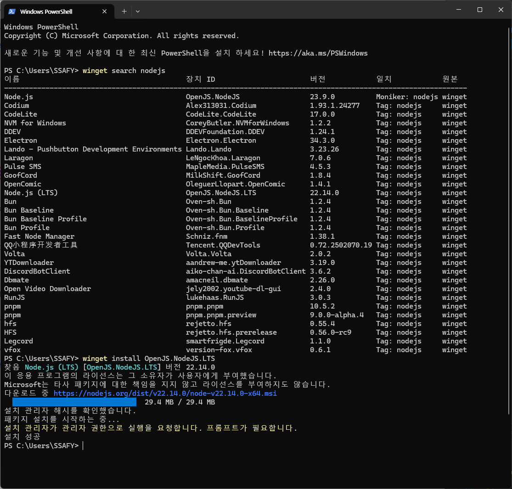

# 250228

# 웹 현장 강의

## Express에 대해

### 서론

- 웹은 창의력 따위 필요없다. 하라는 대로 해야 함.
- Client와 Server 중에 Server : Express를 배울 것.
- 백엔드는 Spring이 왕
- Spring은 복잡 방대 but, node는 파일하나로 끝남.

### 왜 배움?

- HTML, CSS, JavaScript 만으로는 DB에 접근할 수 있는 방법이 없다.
- 프론트엔드와 백엔드 중간에 위치한 DB
- 백엔드는 사실상 현업적으로는 Server와 동일한 말
- 프론트엔드 = 클라이언트
- Node 수업을 배우고 프로젝트가 가능하긴 함.
- 하지만 그것만으로는 현실적으로 힘들어서 Vue.js를 배운다.

### 실시간 통신은 뭘까

- 소켓
- 로봇이 팔을 움직였다? → 클라이언트가 캐치를 해서 그래프도 변해야한다.
- 실시간 통신이 필요함

## 수업 구성

### Express 수업은 REST API 배우는 수업

- REST API를 돌아가게 하기 위한 도구

### 커리큘럼은 총 3일

1. REST 아닌 API
2. REST API
3. 환경 변수
    
    어떤 서버에 접근하고 싶다.
    
    but 아무나 접근하게 하면 안됨.
    
    인증이 필요하다.
    
    토큰 있냐고 요구한다.
    
    → 이런 거 할 것.
    

### 시험은?

- 4지선다도 구현도 아니다.
- Vue.js가 끝나면 출제
- 디버깅 시험 유형으로 나온다.
- Node하고 Vue.js 덜 완성된 파일 2개를 줌.
- 10가지 정도 일부러 에러를 일으킬 것인데
- 2시간 안에 찾으면 됨.
- 멍청하게 VScode가 빨간 줄로 알려주는 걸 내지는 않는다.

## Express 본격 소개

### 현존하는 서버 기술

1. Java - Spring
2. C# - ASP.NET Core
3. Python - Django, Flask, Fast API
4. JavaScript - Express.js, Nest.js

### 장점

1. 기존 학습한 언어인 JavaScript 활용
2. 파일 하나로 끝나는 매우 단순한 구현
3. ORM 대신 SQL 사용 가능 (Django는 SQL을 못 씀, 선택권이 넓다.)

### 단점

1. 지나친 자유도때문에 협업하기에도 불편하고, 실무에도 쓰이지 않음
2. 보안이나 유지보수를 위해 개발자가 직접 신경써야 할 게 많음

→ 웹 개발자 하고 싶으면 Spring 배워라

## node 시작하기

### 세팅



winget을 이용해 Node.js (LTS)를 설치


node가 제대로 설치 되어있는지 버전을 확인

### 원래 JavaScript라는 것은 브라우저 바깥으로 나오지 못했다

- 브라우저에서 밖에 작동하지 못했던 JavaScript를 바깥으로 나올 수 있게 하는 것이 Node
- 할 수 있는게 많아짐


Node를 이용하여 터미널에서 JavaScript를 실행

### node.js 기본적인 실행 실습


Python과 비슷한 방식으로 실행 가능

## NPM Package

### PIP 개념

- 이제 파일 영역에서 벗어나서 프로젝트를 다룰 것
- Python에는 PIP라는 것이 있어서 여러 개발자들이 만들어 놓은 패키지를 사용 가능

### Node에선 NPM

- NPM 홈페이지 들어가서 확인 가능
- JavaScript로 뭘 만들어서 자랑 가능 : 오픈 소스 생태계
- Vue도 여기 검색하면 나옴
- Axios도 나옴

### 지금부터는 패키지를 만든다

- NPM에 배포도 가능
- NPM은 남의 소스 받아오려면 나도 기여 해야함

```
npm init
```

```
PS C:\Users\SSAFY\Desktop\node-class> npm init
This utility will walk you through creating a package.json file.
It only covers the most common items, and tries to guess sensible defaults.

See `npm help init` for definitive documentation on these fields
and exactly what they do.

Use `npm install <pkg>` afterwards to install a package and
save it as a dependency in the package.json file.

Press ^C at any time to quit.
package name: (class)
version: (1.0.0)
description:
entry point: (index.js)
test command:
git repository:
keywords:
author:
license: (ISC)
About to write to C:\Users\SSAFY\Desktop\node-class\package.json:

{
  "name": "class",
  "version": "1.0.0",
  "main": "index.js",
  "scripts": {
    "test": "echo \"Error: no test specified\" && exit 1"
  },
  "author": "",
  "license": "ISC",
  "description": ""
}

Is this OK? (yes)
```

- 이렇게 터미널로 실행 시켜줘서 package.json을 생성 시켜주어야 한다.


npm init 해주기

```json
{
  "name": "class",
  "version": "1.0.0",
  "main": "index.js",
  "scripts": {
    "test": "echo \"Error: no test specified\" && exit 1"
  },
  "author": "",
  "license": "ISC",
  "description": ""
}
```

- `name` 은 패키지 이름
- `main` 은 패키지 실행의 기준이 되는 파일
- `author` 는 제작자

```
npm i express morgan
```


express morgan 설치 시 다음과 같이 나타난다.

```json
{
  "name": "class",
  "version": "1.0.0",
  "main": "index.js",
  "scripts": {
    "test": "echo \"Error: no test specified\" && exit 1"
  },
  "author": "",
  "license": "ISC",
  "description": "",
  "dependencies": {
    "express": "^4.21.2",
    "morgan": "^1.10.0"
  }
}
```

- `package.json` 도 추가
- `dependencies` 는 패키지를 실행시킬 때 필요한 요소들 목록
- `node_modules` 는 넘겨주지 않고, 현업에서는 `lock` 파일만 넘겨주는 것이 관습적

### node_modules 를 지워보자 그 다음엔?

```
npm i
```

- 락파일에 명시된 모든 디펜던시를 포함한 `node_modules` 가 다시 생성된다.

### .gitignore을 이용해서 node_modules를 적자

## Simple API

### inedx.js를 index.mjs로 변환

- package.json은 굳이 변경할 필요 없음, 하나의 명세서일 뿐.

### JavaScript 분리

- js를 쓰다보면 코드가 계속 길어짐 → 분리를 하고 싶다.
- 어떤 식으로?
- 다른 js 파일을 가져올 수 있는 방법 : html에서 `script` 를 이용해 가져온다.
- → 하지만 이거는 브라우저에서 탈출을 못함

```jsx
const a = 1;
```

```jsx
console.log(a);
```

- 2개의 js 파일을 어떻게 연결?

```jsx
const a = 1;

exports.a = a;
```

```jsx
const a = require("./lib");

console.log(a);
```

### CommonJS vs. ES modules

- CJS는 옛날 문법 → ES 모듈이라는 것이 새로 나옴.
- 하지만 하루 아침에 기존에 사용하던 문법을 바꿀 수 없음.
- 이를 번역해주는 컴파일러가 존재 Babel
- 여기서의 컴파일러는 프로그래밍 언어를 기계어로 바꿔준다는 의미는 아니고
    
    다른 문법의 언어를 번역해준다는 의미.
    
- 요즘 브라우저나 node.js는 그것을 기본적으로 제공해줘서 mjs로 돌리기만 해줘도 됨.
- Vue.js 는 ES 모듈을 쓰므로 수업은 ES 모듈로 배운다.

### 실습했던 것 ES 문법으로 바꿔보기

```jsx
const name = "jony";
const age = 10;

export { name, age };
```

```jsx
import { name, age } from "./lib.mjs";

console.log(name);
console.log(age);
```

- `import` 와 `export` 는 서로 반대

### 근데 꼭 객체로 주고 받아야 하나?

```jsx
const name = "jony";
const age = 10;

export default name;
```

```jsx
import name from "./lib.mjs";

console.log(name);
```

- 내보낼 것이 하나밖에 없으면  `export default` 를 써주면 된다.

```jsx
import name from "./lib1.mjs";
import { a, b } from "./lib2.mjs";
```

- 윗 줄은 `lib1.mjs` 전체를 가져왔다고 생각
- 아래는 `lib2.mjs` 에서 a와 b를 가져왔다고 생각

### 기본적인 서버 구문

```jsx
import express from "express";
import morgan from "morgan";
import http from "http";

const app = express();
const PORT = 8000;

app.use(morgan("dev"));
app.use(express.json());

const server = http.createServer(app);

server.listen(PORT, () => console.log(`This server listening on ${PORT}`));
```

- 복붙해서 쓰는 구문
- 서버 종료는 Ctrl + C 누르면 된다.

### 실습

```jsx
import express from "express";
import morgan from "morgan";
import http from "http";

const app = express();
const PORT = 8000;

app.use(morgan("dev"));
app.use(express.json());

app.get("/api/v1/hello-world", (req, res) => {
  try {
    return res.json({
      text: "안녕 Express",
    });
  } catch (error) {
    return res.json({
      error: error,
    });
  }
});

const server = http.createServer(app);

server.listen(PORT, () => console.log(`This server listening on ${PORT}`));

```


### 진짜 서버가 되어가는 과정

- 서버는 서비스를 제공하는 것을 서버라고 함.
- 로컬 호스트는 내 컴퓨터
- 일단 개발 할 때에는 내 컴퓨터에서 테스트를 마침
- 배포 할 때만 서버에 올림
- api는 곧 함수다.
- 함수는? 기능을 수행하는 것
- 이걸 해! 라고 말하면 저렇게 동작하는 것 그것이 api다.

### 실습 : 메뉴판과 Hello Word 두 개 서비스 해보기

```jsx
import express from "express";
import morgan from "morgan";
import http from "http";

const app = express();
const PORT = 8000;

const menus = [
    {
      id: 1,
      name: "짜장면",
      isAvailable: true,
    },
    {
      id: 2,
      name: "짬뽕",
      isAvailable: true,
    },
    {
      id: 3,
      name: "탕수육",
      isAvailable: false,
    },
  ];

app.use(morgan("dev"));
app.use(express.json());

app.get("/api/v1/hello-world", (req, res) => {
  try {
    return res.json({
      text: "안녕 Express",
    });
  } catch (error) {
    return res.json({
      error: error,
    });
  }
});

app.get("/api/v1/menu", (req, res) => {
    try {
      return res.json(menus);
    } catch (error) {
      return res.json({
        error: error,
      });
    }
  });

const server = http.createServer(app);

server.listen(PORT, () => console.log(`This server listening on ${PORT}`));
```

### 저장을 기준으로 서버를 리프레시 해주는 법

1. 터미널을 관리자 권한으로 실행
2. `npm i -g nodemon` 여기서 `-g` 는 전역설치를 의미


- 이제부터 노드 실행의 명령어는 `node` 가 아닌 `nodemon`

### api에 변수 주기 : 파라미터

```
http://localhost:8000/api/v1/add/1/2
```

- 해당 주소의 값을 통해 받아오기

```jsx
app.get("/api/v1/add/:a/:b", (req, res) => {
  try {
    return res.json({
        result: req.params.a + req.params.b,
    });
  } catch (error) {
    return res.json({
      error: error,
    });
  }
});
```

- `params` 를 이용하여 값을 받아옴


결과

- 넘버 파싱이 필요함

```jsx
app.get("/api/v1/add/:a/:b", (req, res) => {
  try {
    return res.json({
        result: Number(req.params.a) + Number(req.params.b),
    });
  } catch (error) {
    return res.json({
      error: error,
    });
  }
});
```


## 6-1 Homework 하기