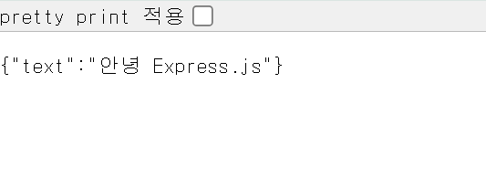

# 250304

# Live 강의 : Node.js - Express.js 기초

## 서버란? : 커리큘럼 소개

### 서버는 그 동안의 3신기로 만들지 못했던 것

- HTML JS CSS로 만들지 못했던 것이 있다.
- 웹을 만들어서 나만 보고 말거면 필요 없음.
- 그러나 쇼핑몰도 만들고 누구나 내가 만든 웹에 접속할 수 있으려면 서버가 필요함.
- 그럼 웹을 그냥 AWS에 올리면 안되냐? 되긴 함.

### 하지만, 그것만으로는 못하는 것

1. DB 접근
    
    브라우저를 통해 데이터에 접근하는 것은 보안 상 매우 위험하다.
    
2. 실시간 통신
    
    게임이나 채팅은 가만히만 있어도 실시간으로 내부 함수가 동작하면서
    
    데이터를 전달해주는 것이 중요.
    

### HTML CSS JavaScript 는 이제부터 Client라 하겠다.

- Client = Front-end라 한다.
- 즉 브라우저를 통해 웹을 보여주는 것.

### 서버 Server(Backend)의 기술 종류

1. Spring (Java)
2. 번째는 없다고 봐도 무방
    
    만약 외국 진출을 꿈꾼다면, [ASP.NET](http://ASP.NET) Core (C#)
    

→ 우리는 Node.js 쓸거임

### 메이저 2개 납두고 Node.js 왜 함?

1. Spring 과 [ASP.NET](http://ASP.NET) Core ⇒ 매우 어렵다…
    
    ⇒ 우리 로봇하러 왔지 웹하러 온 거 아니잖슴
    
    ⇒ 쉬운 걸 배워보자!
    
    단점은 허허벌판, 아무것도 없음, 개발자가 신경써줘야 될게 많긴 함.
    
2. JavaScript 이미 배웠는데, Java 혹은 C# 이라는 언어를 더 배운다는 것은 부담스러운 일.

### Node.js 수업은 곧 Express.js 수업

= 곧 REST 수업이기도 함.

## 시작하기

### Node.js란

브라우저 바깥에서 JavaScript를 실행시킬 수 있게 만들어 준 것.

### Node.js 덕분에…

서버(백엔드) - Express.js, Next.js

모바일앱 - React Native

데스크톱 앱 - Electron (대표적으로 VSCode)

### npm 패키지 둘러보기

- install expres, run 등 흔한 실행명으로 되어있는 패키지 이름을 조심해라
    
    바이러스 가능성 농후
    

### 프로그램 === 애플리케이션

===앱

### index.mjs 작성

```jsx
// express 라는 프로그램에서
// getStatus 라는 것을 가져온다
// import { getStatus } from "express";

// express 라는 프로그램을 가져온다.
import express from "express";
import morgan from "morgan";
import http from "http";

const app = express();
const PORT = 8000;

app.use(morgan("dev"));
app.use(express.json());

const server = http.createServer(app);

server.listen(PORT, () => console.log(`This server is listening on ${PORT}`));
```

### 한 번 실행해보기

```jsx
import express from "express";
import morgan from "morgan";
import http from "http";

const app = express();
const PORT = 8000;

app.use(morgan("dev"));
app.use(express.json());

app.get("/api/v1/hello-world", (req, res) => {
  try {
    return res.json({
      text: "안녕 Express.js",
    });
  } catch (error) {
    return res.json({
      error: error,
    });
  }
});

const server = http.createServer(app);

server.listen(PORT, () => console.log(`This server is listening on ${PORT}`));+ 
```

- `app.get` 에서 `try` 와 `catch` 는 세트
- 주소는 [http://localhost:8000/api/v1/hello-world](http://localhost:8000/api/v1/hello-world)



실행 결과