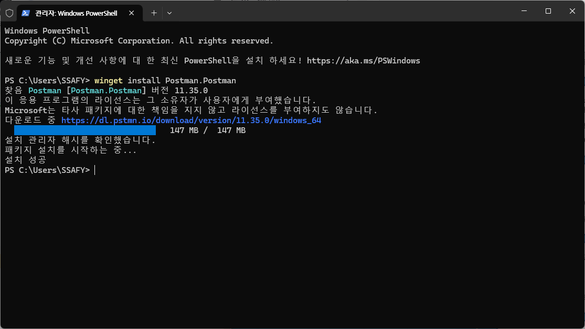

# 250305

# Live 강의 - Node.js : API 작동 원리

## 들어가기

### Postman 설치

- 관리자 권한으로 터미널을 실행 해서 다음 명령어 입력
    
    `winget install Postman.Postman` 
    
    
    
- 이후 가입하라는 안내창이 떠도 계속해서 계정 없이 진행

### API란

- 로봇을 기준으로
    
    `/api/v1/move/:dir`
    
    이 경로에 접근하면, 함수가 실행되는데 이 함수를 API 함수라고 한다.
    
- 추가 예시
    
    `api/v1/todo`
    
    여기에 요청을 보내면 “할 일 목록” 을 받을 수 있다.
    
    예상되는 데이터 셋은 다음과 같음.
    
    ```json
    [
    	{
    		"id": 1
    		"title": "밥 먹기"
    		"is_complete": true
    	},
    	{
    		"id": 2
    		"title": "영화 보기"
    		"is_complete": true
    	}
    ]
    ```
    
- 추가 문제
    
    `/api/v1/todos/:id`
    
    `/api/v1/todos/123` 이렇게 입력을 한다면 뭘 가져올까?
    
    ⇒ 123번 객체가 없으면 undefined.
    
    ⇒ 123번이 아닌 1번으로 하면 객체를 가져옴.
    

### 공통 원칙

- 데이터셋의 이름을 항상 복수로 쓴다.
- 여러개를 가져올거면, 복수로 끝낸다.
    
    ex) `/api/v1/articles`
    
- 아이디에 해당하는 특정 데이터를 가져올거면, 복수 뒤에 아이디 변수를 붙인다.
    
    ex) `/api/v1/articles/:id` 
    

### 이상 배운 원칙이 REST, 그럼 아래는 REST 일까 아닐까

1. `/api/v1/product/id/123` ⇒ X : 단수이며 id가 없어져야 함.
2. `/api/v1/product/all` ⇒ X : 모든 목록을 가져오고 싶으면 all을 빼고 복수형으로만 쓴다.

### REST 등장 배경

- 서버와 클라이언트간 통신을 할 때, 회사마다 규칙이 다 달랐다.
- REST 이전 soap는 체계가 잡혀있지 않았음.

## 해보기

### 지금부터는 브라우저 안쓴다.

- 프론트엔드 개발이 아니기 때문
- 테스트와 체크를 위해서 postman을 사용한다.


```jsx
app.get("/api/v1/login/:id/:pw", (req, res) => {
  try {
    const id = req.params.id;
    const pw = req.params.pw;
    return res.json({
      id: id,
      pw: pw,
    });
  } catch (error) {
    return res.json({
      error: error,
    });
  }
});
```


### 문제점

1. 숨겨야 할 경우 ex) 패스워드
2. 양이 많은 경우

⇒ `params` 를 사용하지 않고 `body` 를 쓴다.

### Body 사용해보기

- Body 탭의 raw 체크
- text를 JSON으로 바꾸기

```jsx
app.get("/api/v1/login", (req, res) => {
  try {
    const id = req.body.id;
    const pw = req.body.pw;
    return res.json({
      id: id,
      pw: pw,
    });
  } catch (error) {
    return res.json({
      error: error,
    });
  }
});
```


### GET의 의미?

- 가져오기
- 브라우저에서 URL 입력할 때
- DB를 변경하지 않음
- CRUD 중 Read에 해당
- Create = POST
- Update = PATCH / PUT
- Delete = DELETE

### 아래는 틀렸음

```jsx
app.get("/api/v1/articles", (req, res) => {
  try {
    const id = req.body.id;
    return res.json({
      id: id,
      title: "안녕하세요",
      author: "jony123",
    });
  } catch (error) {
    return res.json({
      error: error,
    });
  }
});
```

- GET을 쓸 때에는 body를 쓰지 않고 params를 써야 한다.
- 로그인도 보안상 GET을 쓰지 않고 POST를 쓴다.
    
    DB를 수정하지 않지만, 예외적으로 적용.
    

### POST

- 서버에 새로운 데이터를 생성할 때 사용.
- 데이터는 params가 아닌 body 에서, JSON 양식으로 전송
- `/api/v1/articles` 는 뭘 하고자 하는걸까?
- 사실은 이것만 보고 모름
- `GET /api/v1/articles` 와 `POST /api/v1/articles` 가 다름.

### PATCH

- PATCH는 수정
- params와 body 모두 사용
- 단일 조회와 똑같은 경로 사용
- 사실, 대한민국 대부분의 SI에선 PATCH 대신 PUT 사용
- 엄밀히 말하면 REST 원칙에 어긋남
- PUT은 단일 데이터 수정이 아니라 전체 수정을 의미
- `PATCH /articles/:id`
- id에 해당하는 게시글 수정
- params로 id를 보내고 body로 수정할 데이터를 보냄

### DELETE

- DELETE는 body를 쓰지 않는다.
- `DELETE /api/v1/articles/:id`

### 예제

전체 할 일 조회 → `GET /api/v1/todos`
단일 할 일 조회 → `GET /api/v1/todos/:id`
할 일 생성 => `POST /api/v1/todos`
단일 할 일 수정 → `PATCH /api/v1/todos/:id`
단일 할 일 삭제 → `DELETE /api/v1/todos/:id`
전체 할 일 삭제 → `DELETE /api/v1/todos`