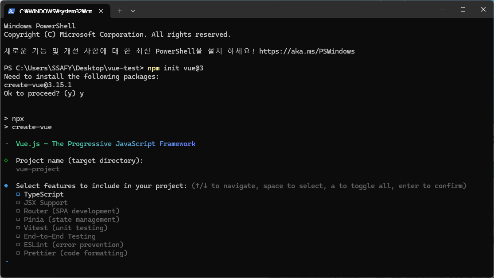

## Vue.js 세팅하기

### 1. 바탕화면에 폴더 생성

`vue-test` 생성 후 해당 폴더에서 터미널 열기

### 2. 다음과 같은 명령어 입력

`npm init vue@3`



y 입력 후 project 이름을 정함

다음과 같은 리스트 체크(Space Bar로 체크)

1. Router
2. Pinia
3. ESLint

Experimental은 No로 체크


### 3. 3가지의 명령어 순차적으로 입력

```
cd vue-project
npm i
npm run dev
```


### 4. Local 부분 Ctrl + 마우스 왼쪽으로 클릭


다음과 같은 창이 뜨면 완료

### 5. vue-project 폴더에서 vscode 실행

### 6. 터미널 열고 npm run dev

### 7. src 폴더 열기

### 8. main.css만 남기고 다 삭제 css 안의 내용도 지움

### 9. component 폴더도 삭제

### 10. /router/index.js 들어가서 다음과 같은 부분 변경

`component: () => import("@/views/HomeView.vue"),` 

### 11. about 필요 없으니 두번째 element도 지워줌

```jsx
import { createRouter, createWebHistory } from "vue-router";
import HomeView from "../views/HomeView.vue";

const router = createRouter({
  history: createWebHistory(import.meta.env.BASE_URL),
  routes: [
    {
      path: "/",
      name: "home",
      component: () => import("@/views/HomeView.vue"),
    },
  ],
});

export default router;

```

### 12. HomeView 부분도 지워줌.

`import HomeView from "../views/HomeView.vue";`

### 13. main.js로 가기

### 14. 맨 위의 점을 @로 바꿔주기

`import '@/assets/main.css'` 

### 15. App.vue로 가기

### 16. 위에 있는 Hello world 날려주기

`import HelloWorld from './components/HelloWorld.vue'`

### 17. Extention에서 Vue - Official 설치

### 18. 프리티어는 Vue - Official로 절대 고르지 마

### 19. template 태그 안을 다음과 같이 바꿔줌

```html
<template>
  <header>
    <nav>
      <ul>
        <li>
          <RouterLink to="/">Home</RouterLink>
        </li>
      </ul>
    </nav>
  </header>
```

### 20. style scoped 밑을 다 지워줌 </style> 만 남기고

### 21. views 안에 들어가서 AboutView는 날림

### 22. HomeView를 다음과 같이 수정

```html
<script setup></script>

<template>
  <h1>Hello World</h1>
</template>

<style scoped></style>
```

### 23. 강력 새로고침 하고 브라우저 창 확인
