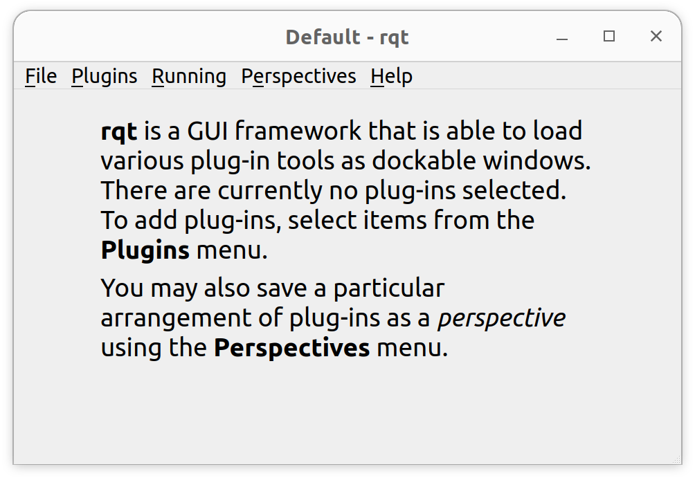

# 240404 ROS기반 통신 인터페이스 ROS 개념

## Turtlesim

### Install rqt

`sudo apt install '~nros-humble-rqt*'` 

`*` 가 의미하는 바는?

→ 뒤에 뭐가 나오든 모두 설치하라는 의미

`rqt` 입력 후 실행하면 다음과 같은 화면 등장



`Plugins` - `Services` - `Service Caller` 


`Call` 을 통해 명령을 날려줌

`/spawn` 명령어의 사용


`/turtle1/set_pen` 의 사용


`ros2 run turtlesim turtle_teleop_key --ros-args --remap turtle1/cmd_vel:=turtle2/cmd_vel` 를 통해 다른 객체의 움직임도 제어


## ROS 핵심 개념

### Nodes

가장 중요한 개념 


오른쪽 위의 NODE가 Message를 발행 → Publisher를 통해 계속 보냄

다른 NODE의 Subscriber는 계속해서 데이터를 받아올려고 시도

**NODE들은 데이터를 주고 받는 하나의 프로그램 단위이다**

### Topics

`rpt_graph` 를 통해 관계도 및 피드백 확인 가능

데이터 퍼블리싱 해보기

`ros2 topic pub /turtle1/cmd_vel geometry_msgs/msg/Twist  "{linear: {x: 2.0, y: 0.0, z: 0.0}, angular: {x: 0.0, y: 0.0, z: 1.8}}"`


퍼블리싱 되는 데이터의 헤르츠 확인하기

`ros2 topic hz /turtle1/pose`


### Services

`ros2 service list`

`ros2 service type /clear`

`ros2 service list -t`

`ros2 service find std_srcs/src/Empty`

`ros2 service call /clear std_srvs/srv/Empty`

### Parameters

`ros2 param list`

`ros2 param get /turtlesim background_g`

→ 배경색의 rgb 중 g 성분의 값을 표현

`ros2 param set /turtlesim background_r 150`

→ 배경색의 r 성분의 값을 150으로 설정


## Simple Publisher and Subscriber

### 실습 개요

Workspace와 package 생성

publisher node 작성

Subscriber node 작성

C++과 Python 실습

### Workspace와 package 생성

`mkdir -p ~/ros2_ws/src` 로 workspace 생성

`ros2_ws` 는 workspace

내가 package를 만든다 → 반드시 `src` 폴더 안에서 만든다

`ros2 pkg create --build-type ament_python my_node` 로 package에 대한 정보 생성

 ws로 나가서 `colcon build` 를 통해 system을 빌드


### Publisher node 작성

workspace단에서 code를 열어 준비


`my_node/__init__.py`에 새로운 노드를 추가

node를 실행하기 위해서는 [`setup.py`](http://setup.py) 를 수정

`my_node/publisher_node.py` 추가


```python
import rclpy
from rclpy.node import Node
from std_msgs.msg import String

class HelloPublisher(Node):
    def __init__(self):
        super().__init__('hello_publisher')
        self.publisher_ = self.create_publisher(String, 'hello_topic', 10)
        self.timer = self.create_timer(1.0, self.timer_callback)
        self.count = 0
    
    def timer_callback(self):
        msg = String()
        msg.data = f'Hello, ROS2: {self.count}'
        self.publisher_.publish(msg)
        self.get_logger().info(f'Publishing: "{msg.data}"')
        self.count += 1

def main(args=None):
    rclpy.init(args=args)
    node = HelloPublisher()
    try:
        rclpy.spin(node)
    except KeyboardInterrupt:
        pass
    finally:
        node.destroy_node()
        rclpy.shutdown()

if __name__ == '__main__':
    main()
```

[`setup.py`](http://setup.py) 에서 노드를 발행할 것이다. 라고 설정

`'console_scripts'` 안에 입력


publisher_node 라는 이름으로 my_node의 publisher_node 노드를 발행할 것이며, main 함수를 이용할 것이다.

`colcon build`

`ros2 run my` 에서 탭을 눌러도 안나옴

build 했지만 리눅스에도 알려줘야함

`code ~/.bashrc` 

밑에 추가 `source ~/ros2_ws/install/local_setup.bash`

`source ~/.bashrc`

`ros2 run my_node publisher_node`


`colcon build` 하고 `source ~/.bashrc` 습관화

### Subscriber node 작성

`/my_node/subscriber_node.py` 생성

```python
import rclpy
from rclpy.node import Node
from std_msgs.msg import String

class HelloSubscriber(Node):
    def __init__(self):
        super().__init__('hello_subscriber')
        self.subscription = self.create_subscription(
            String,
            'hello_topic',
            self.listener_callback,
            10
        )
        self.subscription

    def listener_callback(self, msg):
        self.get_logger().info(f'I heard: "{msg.data}"')

def main(args=None):
    rclpy.init(args=args)
    node = HelloSubscriber()
    try:
        rclpy.spin(node)
    except KeyboardInterrupt:
        pass
    finally:
        node.destroy_node()
        rclpy.shutdown()

if __name__ == '__main__':
    main()
```

[`setup.py`](http://setup.py) 구문 추가

`'subscriber_node = my_node.subscriber_node:main'`

`colcon build`

`source ~/.bashrc` 후 `ros2 run my_node subscriber_node`

