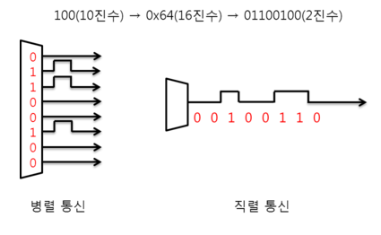

# 250409 산업용 통신

## 산업용 통신 구조

### Digital I/O 통신

- 전기의 전압을 활용하여 기기간 전류를 입력 또는 출력하는 형식
- NPN / PNP 에 따라 제어 타입이 바뀌며, 전압의 크기에 따라 기준 전압이 바뀐다.

### 시리얼(Serial) 통신

- 가장 범용적인 통신 방식
- 케이블에 따라 다양한 통신의 종류가 있다 RS 232, RS 485, USB 통신 등
- 적은 수의 케이블로 데이터를 전송 가능
- 직렬 통신은 순차적으로 데이터를 전달, 병렬은 한번에 전송
- TX, RX만 있으면 됨 (물론 실제로는 Vcc나 GND까지 4가닥 정도)



### 동기식 전송, 비동기식 전송

- 동기식은 시작과 끝을 알리는 클록(Clock) 신호가 추가(물리석인 배선 추가)
- 시작할 때 시작한다고 알려줌
- 비동기식은 Start Bit와 Stop Bit로서 시작과 끝을 구성

- 동기식은 데이터 오류가 적음, 데이터 통신 빠름, 물리적인 배선이 필요, 최소 2개의 라인 필요, 회로도가 복잡
- 비동기식은 배선이 간편, 데이터 손실 위험(요즘은 손실 위험이 적다), 통신 속도가 상대적으로 느리다(고용량이 아닌 일반적인 상황에서는 그렇게 큰 문제는 아니다)

- 저비용의 간단한 구조 및 기술의 발달로 비동기식이 범용적으로 사용
- RS 232, 485 통신이 대표적인 비동기식 통신 방식

| 항목 | 동기식 전송 방식 | 비동기식 전송 방식 |
| --- | --- | --- |
| 통신 속도 | 고속 | 저속 |
| 회로 복잡도 | 복잡 | 복잡 |
| 구축 비용 | 고가 | 저가 |
| 동기 제어 방식 | 클럭 동기 | Start/Stop Bit |
| 전송 단위 | 블록 단위 전송 | 문자 단위 전송 |
| 적용 예 | 전화, ATM, 데이터 통신망 | RS-232, 485 |

### RS-232 통신 규격

- 왜 이렇게 단자가 많아요?
    
    → 나머지 핀들은 범용적으로 쓸 수 있도록 그냥 만들어 놓은 것
    
- 가장 보편적인 Serial 통신 규격
- 전압 레벨에 따라 A, B, C 타입이 존재 (보편적으로 RS-232C를 사용 : 24V)
- 전기적 신호 및 물리적인 핀에 의한 제어 신호를 규정하나 프로토콜은 정의하지 않음
    
    → 따로 프로토콜은 없고 사용자가 정의하기 나름
    
- 전이중(Full Duplex) 통신 방식 지원
    
    → 송신도 할 수 있고 수신도 할 수 있음
    
- 장치간 다중 연결이 가능하지 않음
- TX 라인, RX 라인, GND 라인 3선으로 통신이 이루어진다 → + Vcc 까지 많이 사용

### 용어 정리 1

- 단방향 통신 (Simplex, One Way)
    - 단방향으로만 전송 가능, 수신측에서 송신측으로 응답 불가능
- 양방향 통신, 이중화 통신 (Duplex, Two-way)
    - 반이중 전송방식 (Half Duplex)
    - 전이중 전송방식 (Full Duplex)
- 반이중 전송 방식 (Half Duplex)
    - 통신은 가능하나, 특정 시점에는 한 방향으로 전송이 가능
    송신과 수신이 동시에 이루어지지 않음
- 전이중 전송 방식 (Full Duplex)
    - 양방향으로 동시에 데이터 전송이 가능
    전용으로 할당된 채널을 통해 양단간 점대점(Point to Point) 연결로 동시적 통신이 가능

### RS-485/422 통신 규격

- RS-422 통신 규격
    - 하나의 전송 객체에 대하여 다중 수신 객체를 지정할 수 있다.
    - 정의된 프로토콜은 없지만 다중 객체에 대한 주소 지정(**어드레싱**)이 필요하다.
    - 전이중(Full Duplex)를 지원하며, 2개의 TX 라인과 2개의 RX 라인, GND 라인으로 총 5개의 라인으로 통신한다.
- RS-485 통신 규격
    - RS-422의 확장버전
    - 한 라인에 구축된 모든 장비들이 송수신을 할 수 있다.
    - 반이중(Half Duplex)과 전이중(Full Duplex)통신을 모두 지원한다.
    - 반이중 통신의 경우 3선, 전이중 통신의 경우 5선이 필요하다.

| 항목 | RS232C | RS423 | RS422 | RS485 |
| --- | --- | --- | --- | --- |
| 동작 모드 | Single-Ended | Single-Ended | Differential | Differential |
| 최대 Driver/Receiver 수 | 1 Driver / 1 Receiver | 1 Driver / 10 Receiver | 1 Driver / 32 Receiver | 32 Driver / 32 Receiver |
| 최대 송신거리 | 약 15m | 약 1.2km | 약 1.2km | 약 1.2km |
| 최고 통신속도 | 20kb/s | 100kb/s | 10 Mb/s | 10 Mb/s |
| 지원 전송방식 | Full Duplex | Full Duplex | Full Duplex | Half Duplex |

### Serial USB 통신

- 일반적으로 PC에서 볼 수 있는 USB Port를 활용하는 통신
- 키보드, 마우스 등 Port에 단순 삽입만 하면 됨으로 범용성이 뛰어나다.
- 일반적으로 USB 2.0의 경우 RX TX VCC GND, 4선을 사용한다.

### 용어정리 2

- BPS (Bit Per Second)
    - 1초에 보낼 수 있는 비트(Bit)의 양을 의미한다.
    - 9600 BPS는 1초에 9600개의 Bit 신호를 보낼 수 있다.
- 보오 레이트 (Baud Rate)
    - 초당 보내야 하는 의미있는 데이터 수(Pulse 의 양) 또는 초당 변조 횟수(Frequency)
    - 일반적인 PC에서 Baud Rate와 BPS는 동일하다.
    - 사용자가 정의한 수신 데이터의 크기가 8 bit (1 Byte), BPS가 9600 일 때 Baud Rate는 아래와 같다.
    
    ```
    Baud Rate = 9600 BPS / 8 Bit = 1200 Baud Rate
    비트주기 = 1200Hz 또는 1/1200 * 1,000,000(us) = 833.3(us)
    ```
    
- 시작 비트, 스톱 비트 (Strat Bit, Stop Bit)
    - 데이터 비트의 범위 식별 및 비동기식 통신 방식에서 시작과 끝을 결정하는 신호
    - 실제 데이터는 시작 비트 뒤에 삽입되어 전송된다.
    - 사전 결정된 규칙에 따라 실제 데이터 전송 후 Parity Bit 후 Stop Bit로 통신이 종료된다.
    - ASCII Code 구성
        - 7 Bit(문자 주소) + 1 Bit(에러 검출)


- 패리티 비트 (Parity Bit)
    - 데이터의 구조 및 오류를 체크하는 신호다.
    - 짝수(Even), 홀수(Odd), 마크(Mark), 스페이스(Space) 패리티 비트 등이 존재한다.
    - 짝수 패리티와 홀수 패리티 비트가 범용적으로 사용된다.
    - 데이터의 비트의 1의 개수를 체크하여 짝수일 때, 혹은 홀수일 때, 설정한 짝수/홀수 패리티 비트가 활성화 되어 비트의 짝수 / 홀수를 맞추고 데이터의 오류를 체크한다.
    
    | 7 bits of data | (count of 1-bits) | 8 bits including parity |  |
    | --- | --- | --- | --- |
    |  |  | even | odd |
    | 0000000 | 0 | 00000000 | 00000001 |
    | 0101001 | 3 | 10100011 | 10100010 |
    | 1101001 | 4 | 11010010 | 11010011 |
    | 1111111 | 7 | 11111111 | 11111110 |
    
## TCP / IP 통신

### 이더넷(Ethernet) 통신

- 직렬(Serial) 통신 방식 중 BNC, UTP, STP 케이블을 사용하여 LAN 통신을 한다.
- 이더넷 통신을 하는 디바이스는 48비트 길이의 고유 MAC 주소를 가진다.
- 10Mbps(1Mbps = 1,000,000 bit/sec) 이상의 고속 네트워크 통신을 지원한다.
- 매우 빠른 응답속도를 지원함으로 협동로봇 제어기와 Arm의 통신 지연 속도를 최소화 할 수 있다.
- 대표적으로 TCP/IP 산업 표준 프로토콜을 사용한다.

### TCP/IP (Transmission Control Protocol / Internet Protocol)

- TCP/IP를 지원하는 장치의 경우 고유한 IP 주소를 가져야 한다.
- IP 주소는 네 개의 필드로 구성되어 0부터 255까지의 숫자로 구성 가능하다.
- 단일 네트워크라도 IP주소 및 서브넷 마스크를 가져야 한다.
- 네트워크 부분과 호스트 부분으로 나누어 진다.
- 동일 네트워크 영역에서 Host IP는 달라야 한다.
- 서브넷팅이랑 서브넷 마스크가 필요한 네트워크 주소만 효율적으로 호스트 IP로 분배하는 기능을 의미한다.

### 서브넷 마스크의 네트워크 관리

- IP와 같이 32비트의 네 개의 필드로 구성
- 네트워크 관리 및 호스트 IP를 지정하는 역할을 가지고 있다.
- 기본적으로 Class A, B, C로 분류 된다.
- 서브넷 마스크는 연속된 1비트로 구성되며 0의 값을 가지면 하위 비트는 모두 0이 된다. (중간에 0이 나온 후 1의 값을 가지는 것이 불가능하다.)

```
Class A : 255.0.0.0
Class B : 255.255.0.0
Class C : 255.255.255.0
```

### Class C 서브넷 마스크의 서브넷 네트워크와 Host IP 계산

- 로봇 IP가 `192.168.137.100` 일 때
- 2진수로 나열 후 AND 연산을 한다. (서브넷 네트워크)
- Host IP 범위는 서브넷 마스크 Class C의 0의 개수 n일 때, `2^n - 2` (서브넷 네트워크, 브로드 캐스트) 만큼 할당 가능하다.

| 항목 | 1번째 옥텟 | 2번째 옥텟 | 3번째 옥텟 | 4번째 옥텟 |
| --- | --- | --- | --- | --- |
| **IP 주소 (10진수)** | 192 | 168 | 137 | 100 |
| **IP 주소 (2진수)** | 1100 0000 | 1010 1000 | 1000 1001 | 0110 0100 |
| **서브넷 마스크 (10진수)** | 255 | 255 | 255 | 0 |
| **서브넷 마스크 (2진수)** | 1111 1111 | 1111 1111 | 1111 1111 | 0000 0000 |
- AND 연산 결과가 서브넷 네트워크가 된다.

| 항목 | 1번째 옥텟 | 2번째 옥텟 | 3번째 옥텟 | 4번째 옥텟 |
| --- | --- | --- | --- | --- |
| **IP 주소 (2진수)** | 1100 0000 | 1010 1000 | 1000 1001 | 0110 0100 |
| **서브넷 마스크 (2진수)** | 1111 1111 | 1111 1111 | 1111 1111 | 0000 0000 |
| **AND 결과** | 1100 0000 | 1010 1000 | 1000 1001 | 0000 0000 |
| **서브넷 네트워크 주소** | 192 | 168 | 137 | 0 |

### 서브넷 네트워크 예제

- 조건이 다음과 같을 때, 할당 가능한 IP 개수와 범위를 구하시오.
- 조건 1 : 로봇의 IP가 `192.168.137.100`
- 조건 2 : 서브넷 마스크가 `255.255.252.0`

→ *풀이 :* 

*서브넷 네트워크는* `192.168.136.0` 

*할당 가능한 IP개수는* `2^10 - 2` *= 1022개*

`192.168.136.1` ~ `192.168.139.254`

### 프로토콜

- 통신 규약, 규칙
- 고속 통신에서 오류 보완 및 데이터의 신뢰도를 높이고 약속되지 않은 외부 통신을 차단한다.
- 국제 협약에 따라 다양한 프로토콜 및 통신 보안을 위한 사용자 정의 프로토콜이 존재한다.

### 모드버스 프로토콜

- 제조사별로 다양한 프로토콜이 존재하며, 보안을 위한 전용 프로토콜이 존재하여 제품을 판매 할 때, 프로토콜을 사용자가 이해를 해야 할 필요가 있다.
- 새로운 장비를 구축 할 때마다 매번 새로운 프로토콜을 배워야 하는 문제 발생
- Modicon에서 만든 PLC와 통신을 하기 위해 개발된 프로토콜
- 단순하며, 자동화에 필요한 제어와 모니터링 기능을 수행 가능하여 사실상 표준 프로토콜 규격으로 등장
- 대부분의 통신 장비는 자체 프로토콜과 모드버스 통신을 추가로 지원
- 보안에는 취약하다

### 서버와 클라이언트

- 하나의 서버에 다중 클라이언트가 접속할 수 있다.
- 서버는 전원이 OFF 되면 클라이언트가 접속할 수 없지만, 클라이언트는 전원이 OFF 되어 있어도 서버는 문제없다.
- 서버는 각 클라이언트에서 요청이 오면 데이터를 클라이언트에게 전송한다.
- TCP/IP의 경우 IP + PORT 번호를 서버가 오픈하면 클라이언트는 서버 IP + PORT 번호로 접속을 하게 된다.

### 통신 포트 (TCP/IP)

- TCP/IP 통신을 지원하는 장비에서 내부의 다양한 어플리케이션과 연결하는 통로를 PORT 라고 한다.
- 각 통로마다 고유의 PORT를 사용하며, 모드버스 TCP  통신의 경우 502, 텔넷 통신의 경우 23번 PORT를 사용한다.

### Socket 통신 프로토콜

- 서버 - 클라이언트간 1:1 통신을 하며 다중 접속시 서버에서 대기열을 부여하여 1:1 처리를 한다.
- 산업용 로봇에서 주로 Vision 통신에서 사용된다.
- 포트는 자유롭게 구성가능하며, 서버는 IP + PORT를 오픈하고, 클라이언트는 서버 IP + PORT로 접속한다.

### HTTP 통신 프로토콜

- Hypertext Transfer Protocol, 텍스트 기반의 통신 프로토콜이다.
- 큰 범주에서 보면 HTTP 통신도 소켓통신으로 분류되나, 최근에는 독립된 프로토콜로 분류되고 있다.
- 배달 로봇에서 주로 사용된다. (호출벨 솔루션)

## 통신 실습

### Server

- 서버는 클라이언트의 요청을 받아 처리하는 컴퓨터 또는 프로그램
- 데이터, 파일, 서비스 등을 제공
- 데이터는 서버에 보관
- 서버가 종료되면 클라이언트가 접속할 수 없음

### Client

- 서버의 서비스를 요청하고 사용하는 장치나 프로그램
- 서버에 요청을 보내고, 서버의 데이터를 읽어오거나 업로드

### RS232 & 485 통신

- 마스터(Master)와 슬레이브(Slave) 구조의 통신을 사용
- 서버가 슬레이브의 역할을, 클라이언트가 마스터 역할
- RS232는 1:1 통신
    
    PC(or 마스터)가 명령을 보내고, 장비가 응답을 주는 방식
    
- RS485는 1:N(멀티드롭 방식) 통신을 사용
    
    마스터(Master) 역할을 하는 장치가 여러 슬레이브(Slave)를 관리
    

### TCP(네트워크 통신과 차이점)

- RS232/RS485는 대부분 마스터가 먼저 요청하고 슬레이브가 응답하는 구조
- TCP/IP 통신은 슬레이브가 먼저 요청하는 경우도 많음

### 시리얼 통신 송신

```python
import serial
import time

# 송신 포트 설정 (예: COM3)
ser_tx = serial.Serial("COM3", 9600, timeout=1)

while True:
	ser_tx.write(b"Hello from Sender!\n") # 바이트 데이터 송신
	print("Sent: Hello from Sender!")
	time.sleep(1)
```

### 시리얼 통신 수신

```python
import serial

# 수신 포트 설정 (예: COM4)
ser_rx = serial.Serial("COM4", 9600, timeout=1)

while True:
	data = ser_rx.readline().decode().strip() # 수신된 데이터 읽기
	# 바이트를 문자열로 변환, 불필요한 문자열 제거
	if data:
		print(f"Received: {data}")
		#print("Received: " + data)
```

### Socket 통신 서버

```python
import socket

# 서버 설정
HOST = "127.0.0.1" # 로컬 호스트 (내 PC에서 테스트)
PORT = 12345 # 사용할 포트 번호

# 소켓 생성
server_socket = socket.socket(socket.AF_INET, socket.SOCK,STREAM)
server_socket.bind((HOST, PORT)) # IP & 포트 바인딩
server_socket.listen(1) # 클라이언트 접속 대기

print(f"서버 실행 중... {HOST}:{PORT}")

# 클라이언트 연결 대기
client_socket, addr = server_socket.accept()
print(f"클라이언트 연결됨: {addr}")

# 데이터 수신 & 응답
while True:
	data = client_socket.recv(1024).decode() # 데이터 수신
	if not data:
		break # 클라이언트가 종료하면 루프 탈출
	print(f"클라이언트: {data}")
	
	response = f"서버 응답: {data.upper()}" # 받은 메시지를 대문자로 변환해서 응답
	client_socket.send(response.encode()) # 데이터 송신
	
# 소켓 종료
client_socket.close()
server_socket.close()
```

### Socket 통신 클라이언트

```python
import socket

# 서버 주소 & 포트
HOST = "127.0.0.1" # 서버 주소 (로컬 테스트)
PORT = 12345 # 서버 포트

# 소켓 생성
client_socket = socket.socket(socket.AF_INET, socket.SOCK_STREAM)
client_socket.connect((HOST, PORT)) # 서버에 연결

print("서버에 연결됨!")

while True:
	message = input("메시지 입력 (exit 입력 시 종료): ")
	if message.lower() == "exit":
		break
		
	client_socket.send(message.encode()) # 서버에 메시지 전송
	response = client_socket.recv(1024).decode() # 서버 응답 수신
	print(f"서버 응답: {response}")
	
# 소켓 종료
client_socket.close()
```

### 실행 방법

- 서버 `python server.py`
- 클라이언트 `python client.py`

- socket.AF_INET IPv4 사용
- socket.SOCK_STREAM TCP프로토콜 사용
- bind((HOST, PORT)) 서버의 IP와 포트를 설정
- listen(1) 최대 1개의 클라이언트 연결 허용 (N개의 대기)
- accept() 클라이언트 연결 대기
- send() & recv() 데이터 송수신신