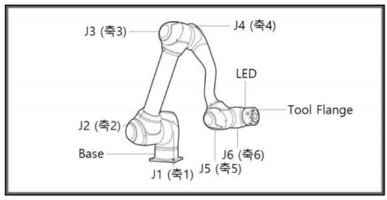

# 250410 이동명령어 : 관절명령, 직교이동

## 협동로봇

### 협동로봇이란?

- 사람과 같은 공간에서 작업하면서 사람과 물리적으로 상호작용할 수 있는 로봇
- 사람과 협동운전을 하는 로봇
- 다관절 로봇이란 최소 1개 이상의 관절을 가진 로봇
- 가장 많이 사용되는 협동로봇은 6축 다관절 로봇

### 산업용 로봇과 협동로봇의 차이

- 산업용 로봇은 작업공간 내 사람의 접근을 배제하여 운전한다.
- 산업용 로봇은 고속 및 큰 토크 운용 가능

### 협동로봇의 특징

- 지금까지의 협동로봇이 들 수 있는 최대 무게는 30kg
- 보통 많이 사용되는 협동 로봇의 작업 무게는 5~10kg
- 사람과의 상호작용을 고려

### 협동로봇의 등장 배경

- 초기의 협동로봇은 사람의 안전을 위해 동력 자체를 제공하지 않음
- 이후 제한적인 동력을 가지는 형태로 발전

### 협동로봇의 정의

- ISO 10218-1 표준에서 4가지 협동운전을 소개
- Safety-rated monitored stop
    - 작업영역에 사람이 없을 경우에만, 로봇은 일반 산업용 로봇(non-collaborative)처럼 동작
- Hand guiding
    - 사람이 손으로 로봇의 자세를 변경할 수 있어야 한다.
- Speed and separation monitoring
    - 로봇과 사람 사이의 거리를 모니터링 할 수 있어야 한다.
- Power and force Limiting
    - 파워와 토크를 항상 감시하고 있으면서 제한할 수 있어야 한다.
- ***위 4가지 운전을 만족하는 로봇을 협동로봇이라고 한다.***

## 이동 명령어

### 로봇 팔

- 실제 움직임이 일어나는 부분
- 축이 많을 수록 다각도로 움직임이 가능하다.
- 일반적으로 6축으로 구성되어 있다.



### 로봇 좌표계 : Joint (관절각 좌표계)

- 화전하는 관절의 회전 각도 값을 기반으로 로봇 자세를 결정하는 좌표계
- ex) `[0, 0, 90, 0, 90, 0]`

### 로봇 좌표계 : 직교(공간, Task) 좌표계

- 공간의 점을 기준으로 로봇의 위치를 결정하는 좌표계
- x, y, z 좌표계를 이용하는 것
- 직관적으로 위치를 파악하기 쉬움
- Base 좌표계 : 끝 단 좌표의 기준은 Base 지점
- Tool 좌표계 : 끝 단에 붙은 점이 [0 0 0] → 상대 좌표계
- Base 좌표계의 움직임과 Tool 좌표계의 움직임의 차이


- BASE 좌표계를 쓰면 X 값과 Z 값을 동시에 수정해야 하는 것을 Tool 좌표계의 Z값만의 조정으로 구현할 수 있다.
- User 좌표계 : 특정한 지점을 원점으로 하는 좌표계
    - Vision 같은거 할 때 사용
    - ex) 물체를 인식하고 마커를 찍은 다음, 제품을 집을 수 있게 세팅하는 사례

### Move J

- 로봇의 목표 자세를 관절각 값을 기반으로 제어하는 모션 명령어
- `movej([joint_1, joint_2, joint_3, joint_4, joint_5, joint_6])`
- 일반적으로 로봇의 최대, 최솟값은 +360, -360 or +180, -180

### Move L

- 로봇의 목표 자세를 Task 값을 기반으로 제어하는 모션 명령어
- 목표 지점까지 최단거리(선형)로 이동한다.
- 특이점이 발생할 가능성이 있다.
- 로봇이 갈 수 없는 자세가 나올 수가 있음
- `movel([X, Y, Z, A, B, C])`

### 특이점 (singularity)

- 특정 위치에서 로봇의 자세를 수학적으로 결정할 수 없거나 무한대의 속도가 발생하는 위치
- 자유도가 사라지는 경우 발생

### Move C

- 원호나 곡선 궤적을 따라 움직이게 하는 명령어
- 두 개의 지정된 점을 거쳐 목표 지점까지 곡선을 그리며 이동하는 데 사용
- Task 좌표계를 사용한다.

## 실습

### 윈도우에서 환경 구성

1. python 3.8.10 설치
2. `py -3.8 -m venv py38_dobot` 이용해서 가상환경 생성
3. `cd .\py38_dobot\Scripts\`
4. `activate`
5. 아래 오류가 뜰 경우 `Set-ExecutionPolicy -Scope Process -ExecutionPolicy Bypass`

```bash
PS C:\work_13th\py38_dobot\Scripts> .\activate
.\activate : 이 시스템에서 스크립트를 실행할 수 없으므로 C:\work_13th\py38_dobot\Scripts\Activate.ps1 파일을 로드할 수
없습니다. 자세한 내용은 about_Execution_Policies(https://go.microsoft.com/fwlink/?LinkID=135170)를 참조하십시오.
위치 줄:1 문자:1
+ .\activate
+ ~~~~~~~~~~
    + CategoryInfo          : 보안 오류: (:) [], PSSecurityException
    + FullyQualifiedErrorId : UnauthorizedAccess
```

1. `pip install dobotedu`

### Point-to-point Movement

| 번호 | 모드 | 좌표 유형 | 이동 유형 | 설명 |
| --- | --- | --- | --- | --- |
| 0 | JUMP | TASK | 절대 이동 | TASK 좌표를 목표로 하는 이동 명령어 |
| 1 | MOVJ | TASK | 절대 이동 | TASK 좌표를 목표로 하는 이동 명령어 |
| 2 | MOVL | TASK | 절대 이동 | TASK 좌표를 목표로 하는 이동 명령어 |
| 3 | JUMP | 관절(Joint) | 절대 이동 | 관절 좌표를 목표로 하는 이동 명령어 |
| 4 | MOVJ | 관절(Joint) | 절대 이동 | 관절 좌표를 목표로 하는 이동 명령어 |
| 5 | MOVL | 관절(Joint) | 절대 이동 | 관절 좌표를 목표로 하는 이동 명령어 |
| 6 | MOVJ | 관절(Joint) | 상대 이동 | 관절 좌표를 목표로 하는 상대 이동 명령어 |
| 7 | MOVL | TASK | 상대 이동 | TASK 좌표를 목표로 하는 상대 이동 명령어 |
| 8 | MOVJ | TASK | 상대 이동 | TASK 좌표를 목표로 하는 상대이동 명령어 |

```python
from pydobotplus import Dobot
import time

port = 'COM6'  # 첫 번째 포트를 선택합니다

# Dobot 연결
device = Dobot(port)

# 홈 위치로 이동 (초기화)
device.home()

time.sleep(1)
device._set_ptp_cmd(mode=4, x=10, y=10, z=10, r=10, wait=2)
device._set_ptp_cmd(mode=4, x=90, y=10, z=10, r=10, wait=2)

# 연결 해제
device.close()
```