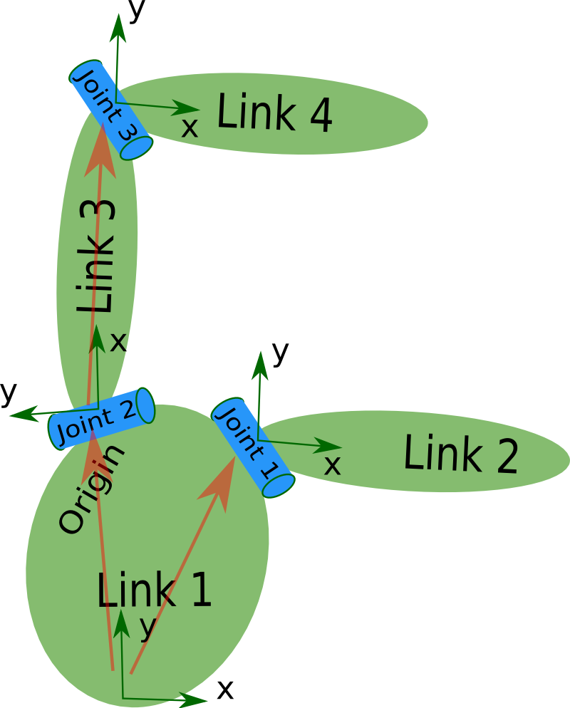

# 250507 임베디드로봇 강의

작성일시: 2025년 5월 7일 오전 9:06
주제: 포인트 클라우드 프로그램: 로봇 모델링
유형: 코딩과정

## Remind

- `source` `./bashrc`

## URDF

### URDF란?

- Unified Robot Description Format(URDF)
- 로봇의 물리적 모델을 정의하기 위한 XML 기반의 파일 형식
- 로봇의 관절, 링크, 모터, 센서 등의 구조와 특성을 기술
- 로봇 시뮬레이션, 시각화 및 제어를 위한 로봇 모델링에 활용



### URDF 파일 구조

- 기본적으로 <robot>, <link>, <joint> 요소로 구성
- <robot> 태그
    - 로봇의 최상의 요소, 이름을 정의
- <link> 태그
    - 로봇의 각 부품(링크)을 정의하는 요소
    - visual, collision, inertia 서브 태그 사용 가능
    - 시각적, 물리적 특성 정의
- <joint> 태그
    - 링크 간의 관계를 설정
    - 회전이나 슬라이딩 등의 운동을 정의
    - 종류: fixed, revolute, prismatic, continuos… 등

## Xacro

### XML Macro

- ROS 환경에서 URDF를 좀 더 간편하게 작성할 수 있도록 돕는 매크로 언어
- 사실상 URDF의 매크로 버전
- URDF로 컴파일되기 전에 매크로를 사용하여 구성 요소들을 동적으로 생성
- 복잡한 파일을 단순화함

### Xacro 사용의 필요성

- 기본적인 URDF는 XML로 작성
- 복잡한 로봇을 정의할 때 많은 중복된 코드가 생길 수 있음
    - (ex: 여러 개의 링크와 조인트가 유사한 속성(모양, 크기, 위치 등)을 가질 때)
- 반복해서 쓰면 코드가 길어지고 관리하기 어려워짐
- Xacro를 사용하면
    - 코드 중복을 제거
    - 유연한 매개변수화 (ex: 링크 크기나 조인트의 위치를 변수로 정의)
    - 반복 작업 감소

### Xacro 주요 기능

- 변수 사용
    - 파라미터화된 URDF 모델을 만들 때 유용
    - 변수는 로봇의 특정 부분의 크기나 모양, 물리적 속성 등을 정의
    - 나중에 여러 곳에서 재사용 가능
- 조건문
    - 단순한 XML을 넘어서는 조건문과 반복문도 지원
    - 종종 보지만 잘 쓰지는 않을 듯

## 링크 속성

### <link> 태그

- 로봇의 각 부품을 정의하는 요소
- 각각의 링크는 로봇의 고정된 부분을 나타내며, 이는 로봇의 바디나 팔, 다리 등의 구성요소가 됨
- 하위 태그
    - `<visual>`: 링크의 시각적 표현을 정의
        - `<geometry>`: 링크의 모양을 정의 (ex: box, cylinder, sphere, mesh 등)
        - `<material>`: 링크의 색상 또는 텍스처
    - `<collision>`: 충돌 감지를 위한 물리적 표현을 정의, 주로 시뮬레이션 충돌을 감지하는 데 사용
        - `<geometry>`: 시각적 표현과 유사하지만 충돌 감지를 위해 사용
    - `<inertial>`: 링크의 질량과 관성 모멘트를 정의
        - `<mass>`: 링크의 질량을 정의
        - `<inertia>`: 링크의 관성 모멘트를 정의

### <joint> 태그

- 로봇의 두 링크 간의 연결을 정의
- 로봇의 움직임을 나타내는 중요한 요소
- 속성
    - name: 조인트의 이름 정의
    - type: 조인트의 종류를 지정 (fixed, revolute, prismatic, continuous 등)
- 하위 태그
    - `<parent>`: 연결된 부모 링크를 지정
    - `<child>`: 연결된 자식 링크를 지정
    - `<origin>`: 부모 링크와 자식 링크 간의 상대적 위치와 회전을 정의
    - `<axis>`: 조인트의 회전 또는 이동 방향을 정의
    - `<limit>`: 조인트의 운동 범위와 제한(최대 힘, 속도, 회전각, 이동거리 등)을 설정

## 링크와 조인트의 관계

- 링크와 조인트는 로봇의 구조를 정의하는 기본적인 요소
- 링크는 로봇의 구성 요소(부품)를 나타내며, 이들 간의 관계를 조인트가 정의
- 조인트는 두 링크를 연결하고, 그 연결된 링크 간의 상대적인 움직임을 설정
    
    ```xml
    <robot name="my_robot">
      <link name="base_link"/>
      
      <joint name="base_to_link1" type="revolute">
        <parent link="base_link"/>
        <child link="link1"/>
      </joint>
      
      <link name="link"/>
    </robot>
    ```
    

## 실습

1. `mkdir rm_ws`
2. `cd rm_ws`
3. `mkdir src`
4. `code ~/.bashrc`
5. `source ~/rm_ws/install/local_setup.bash` 추가
6. `colcon build`
7. `source ~/.bashrc`
8. `cd src`
9. `ros2 pkg create --build-type ament_python urdf_practice`
10. `cd ..`
11. `colcon build`
12. `source ~/.bashrc`
- setup.py
    
    ```python
    from setuptools import find_packages, setup
    from glob import glob
    
    package_name = 'urdf_practice'
    
    setup(
        name=package_name,
        version='0.0.0',
        packages=find_packages(exclude=['test']),
        data_files=[
            ('share/ament_index/resource_index/packages',
                ['resource/' + package_name]),
            ('share/' + package_name, ['package.xml']),
            ('share/' + package_name + '/launch', glob('launch/*.launch.py')),
        ],
        install_requires=['setuptools'],
        zip_safe=True,
        maintainer='ssafy',
        maintainer_email='dan360@naver.com',
        description='TODO: Package description',
        license='TODO: License declaration',
        tests_require=['pytest'],
        entry_points={
            'console_scripts': [
            ],
        },
    )
    
    ```
    
    
    

## D435i 실습

### 카메라 연결 확인

1. `sudo apt update`
2. `sudo apt install v4l-utils`
3. `v4l2-ctl --list-devices`
    
    ```bash
    Intel(R) RealSense(TM) Depth Ca (usb-0000:00:14.0-2.4.2):
    	/dev/video0
    	/dev/video1
    	/dev/video2
    	/dev/video3
    	/dev/video4
    	/dev/video5
    	/dev/media0
    	/dev/media1
    
    ```
    

### 설치

1. 인터넷 창에 다음 검색 ‘intel realsense d435i ros2 humble’
2. 또는 해당 링크로 접속 [https://github.com/IntelRealSense/realsense-ros](https://github.com/IntelRealSense/realsense-ros)
3. 해당 구문을 참고


1. Otherwise, 문구에 나와있는 단락으로 이동
2. 터미널 이용해 설치 후 실행
    
    
    
3. 이후 Step 3의 Option 1을 참고하여 `sudo apt install ros-humble-realsense2-*` 실행
4. 실행하는 방법은 2가지가 있음 run과 launch
5. `ros2 run realsense2_camera realsense2_camera_node` 한번 실행해보기 
6. 결과는 아래와 같다.


1. topic list 한번 확인해보기, 갖가지 camera 관련 topic이 실행 중임을 확인 가능


1. Launch로 실행하는 방법은 다음과 같음 `ros2 launch realsense2_camera rs_launch.py`

## RGBD 데이터 시각화

### 시각화 툴 2가지

1. ros2 run rqt_image_view rqt_image_view
2. rviz

### rqt_image_view


### rviz

1. rviz2 실행
2. add - image - topic 선택


