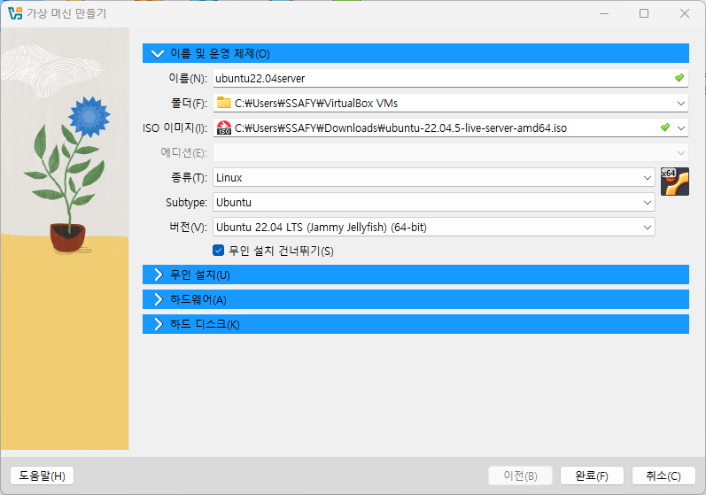

## Virtual Box 환경 세팅

## 필요성

3월 31일 리눅스 개발 시험

virtual box를 깔고 설치

리눅스 22.04

노트북엔 desktop 깔 것

## 설치 툴

우분투 공식 홈페이지는 이용하지 않는다.

여러가지 미러 사이트를 이용

1. KAIST
2. KAKAO
3. harukasan mirror(부경대) → 운영종료

## 설치 방법

1. 다음 링크 이용해서 iso 파일 다운로드
    
    [https://mirror.kakao.com/ubuntu-releases/jammy/ubuntu-22.04.5-live-server-amd64.iso](https://mirror.kakao.com/ubuntu-releases/jammy/ubuntu-22.04.5-live-server-amd64.iso)
    
2. `winget install Oracle.VirtualBox` 로 VirtualBox 설치
3. VirtualBox 홈페이지 들어가서 Download 탭 들어가기
4. Accept and download 클릭
5. 확장 프로그램  실행해서 동의 후 설치
6. VirtualBox 실행 후 새로 만들기 클릭
7. 이름을 ubuntu22.04server로 정확하게 설정
8. 폴더 경로 확인 C:\Users\SSAFY\VirtualBox VMs
9. ISO 이미지를 다운 받은 ISO 파일로 등록
10. 운영 체제 종류와 버전을 자세히 설정

1. 다음 클릭
2. 하드웨어 기본 메모리 8192MB까지 설정
3. 프로세서 CPU 4개로 설정 후 다음
4. 하드 디스크는 60GB로 설정 후 다음 → 완료 클릭
5. 운영체제 목록 우클릭 후 설정

1. 설정창에서 Basic 탭을 Expert로 전환
2. 네트워크 탭에서 포트 포워딩 클릭
3. 추가 버튼을 클릭 후, 이름을 ssh로 변경, 호스트 포트 22, 게스트 포트 22
4. 운영 체제 목록을 더블 클릭해서 실행
5. 서버 install
6. English 선택하고 계속 done
7. mirror는 `http://ftp.kaist.ac.kr/ubuntu` 입력하고 엔터 치지 말고 커서를 밑으로 내리면 테스트 진행 → 에러 뜨는지 확인 `This mirror location passed tests.` 뜨면 됨.
8. Set up this disk as an LVM group 체크 해제 (스페이스바)
9. done 후 continue 후 Your name 적기
    
    권장하는 이름 방식 username : student
    
    servername: student-server
    
    pick a username : student
    
    password: 1
    
    password: 1
    
10. Skip for now - Continue - done - done 하면 설치 화면이 나옴
11. mobaxterm 실행
12. settings - configuration - font - consolas
13. `sudo apt update`
14. `sudo apt upgrade` 진짜요? 나오면 y 입력
15. 보라색 화면 나오면 엔터쳐서 넘어감
16. `sudo apt install openssh-server net-tools`
17. 엔터 쳐서 넘어가기
18. 다시 mobaxterm으로 넘어가서 user sessions 클릭 ssh탭에서 remote host
    
    `192.168.56.1`
    
19. Specify username 체크 후 아까 설정했던 username 입력
20. 북마크 설정에서 ip가 입력되어 있는 부분 다 지우고 virtualbox_ubuntu 입력
21. accept 후 비번 치면 do not again 어쩌구 체크 후 No 클릭

## 사용법

1. 시험 칠 때에는 virtualbox를 키고
2. 우분투를 키고
3. moba를 들어가서
4. vi로 시험을 친다.

### mobaxterm 설정

1. `sudo apt install build-essential`
2. `gcc --version`
3. `make --version`
4. `g++ --version` 
5. `touch main.c`
6. `vi main.c`
7. a 치고 Insert로 변경
8. hello world 코드 치고 esc 후 :
9. sudo shutdown -h now
